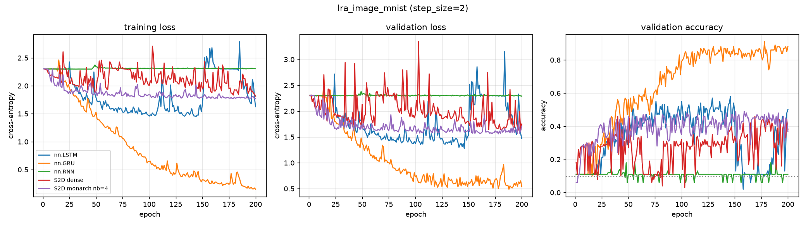

# lra_image_mnist — recurrent core comparison

Generated by `examples/lra_benchmark.py` from `lra_image_mnist_step2/config.yaml`.

## Setup

| | |
| --- | --- |
| dataset | `lra_image_mnist` |
| sequence length | 392 |
| features per timestep (`step_size`) | 2 |
| classes | 10 (chance = 0.100) |
| train / val / test | 800 / 100 / 100 |
| epochs | 200 |
| batch size | 64 |
| learning rate | 0.001 (per-model overrides shown in the table) |
| gradient clip | 1.0 |
| device | cuda |

> ## A SCREENING RUN, ONE SEED, ONE LEARNING RATE
>
> This cell is one of 20 in `difficulty_ladder/`, run to locate a
> dataset/`step_size` combination worth studying properly. It is not a benchmark
> result and no number here should be quoted on its own.
>
> **One seed and one learning rate (1e-3).** There are no error bars beyond
> evaluation-set sampling noise, and a model that would do better at a different
> rate looks worse here. 1e-3 was chosen because every past run at
> `hidden_size: 128` trained all five of these models without diverging; the
> divergences recorded in `RESEARCH_LOG.md` 2.4 were all at $d_h = 2048$.
>
> **`lra_toy_bw` and `lra_image_mnist` hold 1000 rows**, so their test splits are
> 100 rows and the standard error is about 0.05 — differences below ~0.14 are not
> resolvable there. Those two rungs can support "saturated / not saturated" and
> nothing finer. `lra_image` and `lra_pathfinder` have 1000-row test splits and
> resolve about 0.04.
>
> **Epoch budgets differ by dataset** (20 / 200 / 50 / 50) because a single budget
> is impossible across a ladder where one task separates in two epochs and another
> sits at chance until epoch 60. They are recorded per cell in the Setup table.
>
> **Cells are different tasks.** `step_size` sets both `seq_len` and `input_size`,
> so accuracies from two cells may not be placed on one axis.

## Results

Test accuracy is from the epoch with the best validation accuracy.
One seed. Validation and test splits are 100 and 100 rows, so the standard error at the best accuracy here (0.810) is about 0.039.

| model | params | lr | best val acc | test acc | epoch | wall clock | s / epoch (incl. val) |
| --- | ---: | ---: | ---: | ---: | ---: | ---: | ---: |
| nn.LSTM | 68,874 | 0.001 | 0.5800 | 0.4600 | 146 | 9 s | 0.0 |
| nn.GRU | 51,978 | 0.001 | 0.9100 | 0.8100 | 178 | 4 s | 0.0 |
| nn.RNN | 18,186 | 0.001 | 0.1800 | 0.0800 | 48 | 5 s | 0.0 |
| S2D dense | 18,058 | 0.001 | 0.4600 | 0.3500 | 40 | 242 s | 1.2 |
| S2D monarch nb=4 | 5,770 | 0.001 | 0.4900 | 0.3600 | 151 | 529 s | 2.6 |

## Per-epoch curves



## Config

```yaml
notes: "## A SCREENING RUN, ONE SEED, ONE LEARNING RATE\n\nThis cell is one of 20\
  \ in `difficulty_ladder/`, run to locate a\ndataset/`step_size` combination worth\
  \ studying properly. It is not a benchmark\nresult and no number here should be\
  \ quoted on its own.\n\n**One seed and one learning rate (1e-3).** There are no\
  \ error bars beyond\nevaluation-set sampling noise, and a model that would do better\
  \ at a different\nrate looks worse here. 1e-3 was chosen because every past run\
  \ at\n`hidden_size: 128` trained all five of these models without diverging; the\n\
  divergences recorded in `RESEARCH_LOG.md` 2.4 were all at $d_h = 2048$.\n\n**`lra_toy_bw`\
  \ and `lra_image_mnist` hold 1000 rows**, so their test splits are\n100 rows and\
  \ the standard error is about 0.05 \u2014 differences below ~0.14 are not\nresolvable\
  \ there. Those two rungs can support \"saturated / not saturated\" and\nnothing\
  \ finer. `lra_image` and `lra_pathfinder` have 1000-row test splits and\nresolve\
  \ about 0.04.\n\n**Epoch budgets differ by dataset** (20 / 200 / 50 / 50) because\
  \ a single budget\nis impossible across a ladder where one task separates in two\
  \ epochs and another\nsits at chance until epoch 60. They are recorded per cell\
  \ in the Setup table.\n\n**Cells are different tasks.** `step_size` sets both `seq_len`\
  \ and `input_size`,\nso accuracies from two cells may not be placed on one axis.\n"
dataset:
  max_points: null
  train_frac: 0.8
  val_frac: 0.1
  split_seed: 0
  embedding: null
  local: true
  data_dir: ../generatedata/data/processed
  name: lra_image_mnist
  step_size: 2
training:
  epochs: 200
  batch_size: 64
  lr: 0.001
  grad_clip: 1.0
  seed: 0
  device: cuda
models:
- name: nn.LSTM
  type: lstm
  hidden_size: 128
- name: nn.GRU
  type: gru
  hidden_size: 128
- name: nn.RNN
  type: rnn
  hidden_size: 128
- name: S2D dense
  type: sequential2d
  hidden_size: 128
  K: 1
- name: S2D monarch nb=4
  type: sequential2d
  hidden_size: 128
  K: 1
  W_hh: monarch
  num_blocks: 4
```
