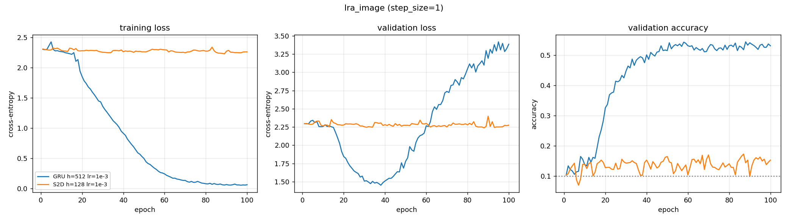

# lra_image — recurrent core comparison

Generated by `examples/lra_benchmark.py` from `epoch_probe/config.yaml`.

## Setup

| | |
| --- | --- |
| dataset | `lra_image` |
| sequence length | 1024 |
| features per timestep (`step_size`) | 1 |
| classes | 10 (chance = 0.100) |
| train / val / test | 8000 / 1000 / 1000 |
| epochs | 100 |
| batch size | 64 |
| learning rate | 0.001 (per-model overrides shown in the table) |
| gradient clip | 1.0 |
| device | cuda |

> ## WHAT THIS RUN IS FOR
>
> This is an **epoch-budget measurement**, not a model comparison. Two rows at two
> different widths and two different architectures are not comparable to each
> other; the only quantity being read off is *where each curve stops improving*.
>
> Epochs 1-30 reproduce `image_wide_lr/` exactly by construction (same
> `split_seed`, `lr`, `batch_size` and split). If they do not, this run is void.
>
> **It does not measure whether the plateau epoch depends on width.** Only $d_h$ =
> 512 (GRU) and 128 (ours) were run, confounded with architecture. The width sweep
> still needs its own check.

## Results

Test accuracy is from the epoch with the best validation accuracy.
One seed. Validation and test splits are 1000 and 1000 rows, so the standard error at the best accuracy here (0.545) is about 0.016.

| model | params | lr | best val acc | test acc | epoch | wall clock | s / epoch (incl. val) |
| --- | ---: | ---: | ---: | ---: | ---: | ---: | ---: |
| GRU h=512 lr=1e-3 | 796,170 | 0.001 | 0.5440 | 0.5450 | 88 | 903 s | 9.0 |
| S2D h=128 lr=1e-3 | 17,930 | 0.001 | 0.1730 | 0.1770 | 87 | 2929 s | 29.3 |

## Per-epoch curves



## Config

```yaml
notes: '## WHAT THIS RUN IS FOR


  This is an **epoch-budget measurement**, not a model comparison. Two rows at two

  different widths and two different architectures are not comparable to each

  other; the only quantity being read off is *where each curve stops improving*.


  Epochs 1-30 reproduce `image_wide_lr/` exactly by construction (same

  `split_seed`, `lr`, `batch_size` and split). If they do not, this run is void.


  **It does not measure whether the plateau epoch depends on width.** Only $d_h$ =

  512 (GRU) and 128 (ours) were run, confounded with architecture. The width sweep

  still needs its own check.

  '
dataset:
  name: lra_image
  step_size: 1
  train_frac: 0.8
  val_frac: 0.1
  split_seed: 0
  embedding: null
training:
  epochs: 100
  batch_size: 64
  lr: 0.001
  grad_clip: 1.0
  seed: 0
  device: cuda
models:
- name: GRU h=512 lr=1e-3
  type: gru
  hidden_size: 512
  lr: 0.001
- name: S2D h=128 lr=1e-3
  type: sequential2d
  hidden_size: 128
  K: 1
  lr: 0.001
```
