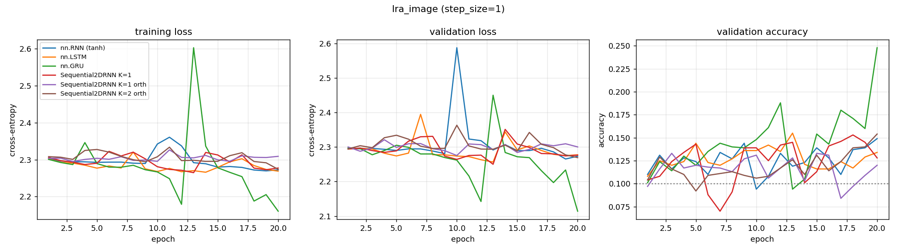

# lra_image — recurrent core comparison

Generated by `examples/lra_benchmark.py` from `image_full/config.yaml`.

## Setup

| | |
| --- | --- |
| dataset | `lra_image` |
| sequence length | 1024 |
| features per timestep (`step_size`) | 1 |
| classes | 10 (chance = 0.100) |
| train / val / test | 8000 / 1000 / 1000 |
| epochs | 20 |
| batch size | 64 |
| learning rate | 0.001 (per-model overrides shown in the table) |
| gradient clip | 1.0 |
| device | cuda |

> ## READ THIS BEFORE USING THESE NUMBERS
>
> **Undertrained.** 20 epochs is below where models start learning on this task,
> and that was measured after the run. `nn.GRU h=512` reached 0.159 val accuracy at
> epoch 15, 0.326 at 20 and 0.447 at 30, still climbing. Every number here is
> therefore a lower bound taken before the models had finished learning, and
> `image_wide_lr/` supersedes this run for anything at seq 1024.
>
> Left at 20 epochs for the record. Raise to 30+ before quoting it.
>
> One thing here is solid: `nn.RNN` has 18,058 parameters against
> `Sequential2DRNN K=1`'s 17,930, a difference of exactly 128 = `hidden_size`.
> That is PyTorch's second bias vector, folded into one per Sec. 8.2 of
> `tasks/OVERVIEW_RNN_SEQUENTIAL_2D.md`, showing up in a parameter count.
>
> The `orth` rows are a null result at gain 1.2 (0.1330 against 0.1530 for default
> init). Combined with gain 1.0 failing in `image_wide/`, the orthogonal-init
> hypothesis has failed to transfer twice at seq 1024.

## Results

Test accuracy is from the epoch with the best validation accuracy.
One seed. Validation and test splits are 1000 and 1000 rows, so the standard error at the best accuracy here (0.230) is about 0.013.

| model | params | lr | best val acc | test acc | epoch | wall clock | s / epoch (incl. val) |
| --- | ---: | ---: | ---: | ---: | ---: | ---: | ---: |
| nn.RNN (tanh) | 18,058 | 0.001 | 0.1490 | 0.1520 | 20 | 8 s | 0.4 |
| nn.LSTM | 68,362 | 0.001 | 0.1550 | 0.1510 | 13 | 17 s | 0.9 |
| nn.GRU | 51,594 | 0.001 | 0.2480 | 0.2300 | 20 | 10 s | 0.5 |
| Sequential2DRNN K=1 | 17,930 | 0.001 | 0.1530 | 0.1630 | 18 | 580 s | 29.0 |
| Sequential2DRNN K=1 orth | 17,930 | 0.001 | 0.1330 | 0.1240 | 3 | 572 s | 28.6 |
| Sequential2DRNN K=2 orth | 17,930 | 0.001 | 0.1540 | 0.1480 | 20 | 1131 s | 56.5 |

## Per-epoch curves



## Config

```yaml
notes: '## READ THIS BEFORE USING THESE NUMBERS


  **Undertrained.** 20 epochs is below where models start learning on this task,

  and that was measured after the run. `nn.GRU h=512` reached 0.159 val accuracy at

  epoch 15, 0.326 at 20 and 0.447 at 30, still climbing. Every number here is

  therefore a lower bound taken before the models had finished learning, and

  `image_wide_lr/` supersedes this run for anything at seq 1024.


  Left at 20 epochs for the record. Raise to 30+ before quoting it.


  One thing here is solid: `nn.RNN` has 18,058 parameters against

  `Sequential2DRNN K=1`''s 17,930, a difference of exactly 128 = `hidden_size`.

  That is PyTorch''s second bias vector, folded into one per Sec. 8.2 of

  `tasks/OVERVIEW_RNN_SEQUENTIAL_2D.md`, showing up in a parameter count.


  The `orth` rows are a null result at gain 1.2 (0.1330 against 0.1530 for default

  init). Combined with gain 1.0 failing in `image_wide/`, the orthogonal-init

  hypothesis has failed to transfer twice at seq 1024.

  '
dataset:
  name: lra_image
  step_size: 1
  train_frac: 0.8
  val_frac: 0.1
  split_seed: 0
  embedding: null
training:
  epochs: 20
  batch_size: 64
  lr: 0.001
  grad_clip: 1.0
  seed: 0
  device: cuda
models:
- name: nn.RNN (tanh)
  type: rnn
  hidden_size: 128
- name: nn.LSTM
  type: lstm
  hidden_size: 128
- name: nn.GRU
  type: gru
  hidden_size: 128
- name: Sequential2DRNN K=1
  type: sequential2d
  hidden_size: 128
  K: 1
- name: Sequential2DRNN K=1 orth
  type: sequential2d
  hidden_size: 128
  K: 1
  orthogonal_hh: true
  gain: 1.2
- name: Sequential2DRNN K=2 orth
  type: sequential2d
  hidden_size: 128
  K: 2
  orthogonal_hh: true
  gain: 1.2
```
