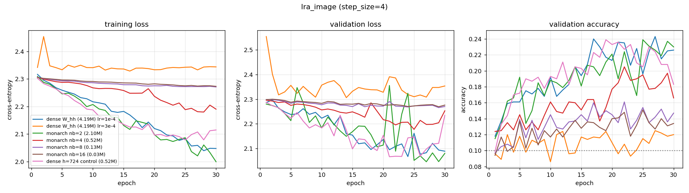

# lra_image — recurrent core comparison

Generated by `examples/lra_benchmark.py` from `image_monarch/config.yaml`.

## Setup

| | |
| --- | --- |
| dataset | `lra_image` |
| sequence length | 256 |
| features per timestep (`step_size`) | 4 |
| classes | 10 (chance = 0.100) |
| train / val / test | 8000 / 1000 / 1000 |
| epochs | 30 |
| batch size | 64 |
| learning rate | 0.0001 (per-model overrides shown in the table) |
| gradient clip | 1.0 |
| device | cuda |

> ## WITHDRAWN — THE BLOCK-COUNT RANKING HERE IS CONFOUNDED
>
> The `nb` = 4, 8, 16 rows ran on `MonarchLinear`'s **factored** path and the
> `dense` and `nb=2` rows did not, so `nb` moved three things together: the
> sparsity of $S$, whether the blocks were independent or weight-tied products, and
> the initialisation gain of $W_{hh}$. At $d_h = 2048$ the factored rows had
> $\sigma_{\max}$ = 0.87 / 0.60 / 0.42 against dense's 1.15 — contractions in every
> direction at initialisation, so they could not carry the hidden state across one
> step, let alone 256. That accounts for the ranking below with no sparsity
> mechanism needed. See `RESEARCH_LOG.md` §2.3 and §3.3.
>
> The parameter counts in the row names are factored counts and do not describe
> what the current code builds: `nb=4` is 1.05 M, not 0.52 M.
>
> ## SCOPE OF THESE NUMBERS (as originally written)
>
> **Internally clean.** All five block-count rows and the parameter-matched
> `dense h=724` control ran at the same lr (1e-4), epochs (30) and `step_size` (4),
> so the ranking by block count is a fair comparison. — *Not true: see above. They
> did not share a model class.*
>
> **But this is not the LRA task.** `step_size: 4` makes `seq_len` 256 rather than
> 1024 *and* `input_size` 4 rather than 1 — the model sees four adjacent pixels per
> step, which is a 1D patch embedding. That is a different, easier task with a wider
> input, not a shorter version of the same one. Do not place these numbers on the
> same axis as any `step_size: 1` run. The value 4 was chosen arbitrarily.
>
> **Weakly powered as a regularisation test.** The dense row's train/val gap was
> only 0.04, and sparsity-as-regulariser needs a model that overfits substantially.
>
> **Two rows had not plateaued** when the epoch budget ran out — `dense W_hh (4.19M)
> lr=1e-4` (best val on epoch 27, train loss still descending) and `monarch nb=2
> (2.10M)` (final train loss 1.9992, below dense's 2.0474). Their numbers are lower
> bounds. Do not rank them against a converged row without giving them more epochs.
>
> The row names count parameters **in `W_hh` only**; the `params` column is the
> whole model, so `nb=4` shows 555,018 against the control's 535,046 even though
> their $W_{hh}$ blocks match to 112 parameters. `results.json` for this run also
> carries a `truncated` key per model, left by a `was_truncated()` helper that has
> since been removed from the harness.

## Results

Test accuracy is from the epoch with the best validation accuracy.
One seed. Validation and test splits are 1000 and 1000 rows, so the standard error at the best accuracy here (0.252) is about 0.014.

| model | params | lr | best val acc | test acc | epoch | wall clock | s / epoch (incl. val) |
| --- | ---: | ---: | ---: | ---: | ---: | ---: | ---: |
| dense W_hh (4.19M) lr=1e-4 | 4,225,034 | 0.0001 | 0.2430 | 0.2520 | 27 | 251 s | 8.4 |
| dense W_hh (4.19M) lr=3e-4 | 4,225,034 | 0.0003 | 0.1250 | 0.1100 | 27 | 251 s | 8.4 |
| monarch nb=2 (2.10M) | 2,127,882 | 0.0001 | 0.2390 | 0.2270 | 25 | 545 s | 18.2 |
| monarch nb=4 (0.52M) | 555,018 | 0.0001 | 0.2050 | 0.1930 | 22 | 741 s | 24.7 |
| monarch nb=8 (0.13M) | 161,802 | 0.0001 | 0.1610 | 0.1350 | 22 | 1428 s | 47.6 |
| monarch nb=16 (0.03M) | 63,498 | 0.0001 | 0.1510 | 0.1250 | 25 | 2763 s | 92.1 |
| dense h=724 control (0.52M) | 535,046 | 0.0001 | 0.2390 | 0.2150 | 19 | 252 s | 8.4 |

## Per-epoch curves



## Config

```yaml
notes: "## SCOPE OF THESE NUMBERS\n\n**Internally clean.** All five block-count rows\
  \ and the parameter-matched\n`dense h=724` control ran at the same lr (1e-4), epochs\
  \ (30) and `step_size` (4),\nso the ranking by block count is a fair comparison.\n\
  \n**But this is not the LRA task.** `step_size: 4` makes `seq_len` 256 rather than\n\
  1024 *and* `input_size` 4 rather than 1 \u2014 the model sees four adjacent pixels\
  \ per\nstep, which is a 1D patch embedding. That is a different, easier task with\
  \ a wider\ninput, not a shorter version of the same one. Do not place these numbers\
  \ on the\nsame axis as any `step_size: 1` run. The value 4 was chosen arbitrarily.\n\
  \n**Weakly powered as a regularisation test.** The dense row's train/val gap was\n\
  only 0.04, and sparsity-as-regulariser needs a model that overfits substantially.\n\
  \n**Two rows had not plateaued** when the epoch budget ran out \u2014 `dense W_hh\
  \ (4.19M)\nlr=1e-4` (best val on epoch 27, train loss still descending) and `monarch\
  \ nb=2\n(2.10M)` (final train loss 1.9992, below dense's 2.0474). Their numbers\
  \ are lower\nbounds. Do not rank them against a converged row without giving them\
  \ more epochs.\n\nThe row names count parameters **in `W_hh` only**; the `params`\
  \ column is the\nwhole model, so `nb=4` shows 555,018 against the control's 535,046\
  \ even though\ntheir $W_{hh}$ blocks match to 112 parameters. `results.json` for\
  \ this run also\ncarries a `truncated` key per model, left by a `was_truncated()`\
  \ helper that has\nsince been removed from the harness.\n"
dataset:
  name: lra_image
  step_size: 4
  train_frac: 0.8
  val_frac: 0.1
  split_seed: 0
  embedding: null
training:
  epochs: 30
  batch_size: 64
  lr: 0.0001
  grad_clip: 1.0
  seed: 0
  device: cuda
models:
- name: dense W_hh (4.19M) lr=1e-4
  type: sequential2d
  hidden_size: 2048
  K: 1
- name: dense W_hh (4.19M) lr=3e-4
  type: sequential2d
  hidden_size: 2048
  K: 1
  lr: 0.0003
- name: monarch nb=2 (2.10M)
  type: sequential2d
  hidden_size: 2048
  K: 1
  W_hh: monarch
  num_blocks: 2
- name: monarch nb=4 (0.52M)
  type: sequential2d
  hidden_size: 2048
  K: 1
  W_hh: monarch
  num_blocks: 4
- name: monarch nb=8 (0.13M)
  type: sequential2d
  hidden_size: 2048
  K: 1
  W_hh: monarch
  num_blocks: 8
- name: monarch nb=16 (0.03M)
  type: sequential2d
  hidden_size: 2048
  K: 1
  W_hh: monarch
  num_blocks: 16
- name: dense h=724 control (0.52M)
  type: sequential2d
  hidden_size: 724
  K: 1
```
