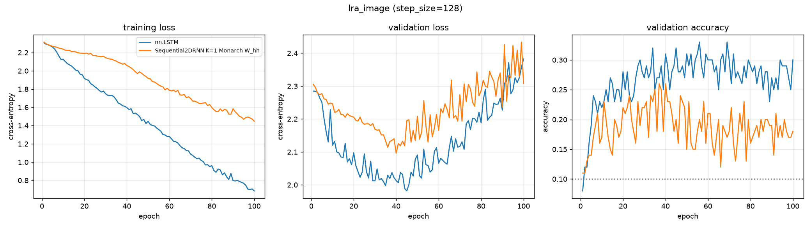

# lra_image — recurrent core comparison

Generated by `examples/lra_benchmark.py` from `image_rcp/config.yaml`.

## Setup

| | |
| --- | --- |
| dataset | `lra_image` |
| sequence length | 8 |
| features per timestep (`step_size`) | 128 |
| classes | 10 (chance = 0.100) |
| train / val / test | 800 / 100 / 100 |
| epochs | 100 |
| batch size | 128 |
| learning rate | 0.001 (per-model overrides shown in the table) |
| gradient clip | 1.0 |
| device | cuda |

## Results

Test accuracy is from the epoch with the best validation accuracy.
One seed. Validation and test splits are 100 and 100 rows, so the standard error at the best accuracy here (0.260) is about 0.044.

| model | params | lr | best val acc | test acc | epoch | wall clock | s / epoch (incl. val) |
| --- | ---: | ---: | ---: | ---: | ---: | ---: | ---: |
| nn.LSTM | 133,386 | 0.001 | 0.3300 | 0.2600 | 56 | 1 s | 0.0 |
| Sequential2DRNN K=1 Monarch W_hh | 18,314 | 0.001 | 0.2600 | 0.1700 | 37 | 19 s | 0.2 |

## Per-epoch curves



## Config

```yaml
dataset:
  name: lra_image
  step_size: 128
  max_points: 1000
  train_frac: 0.8
  val_frac: 0.1
  split_seed: 0
  embedding: null
training:
  epochs: 100
  batch_size: 128
  lr: 0.001
  grad_clip: 1.0
  seed: 0
  device: cuda
models:
- name: nn.LSTM
  type: lstm
  hidden_size: 128
- name: Sequential2DRNN K=1 Monarch W_hh
  type: sequential2d
  hidden_size: 128
  K: 2
  W_hh: monarch
  num_blocks: 8
  activation: relu
```
