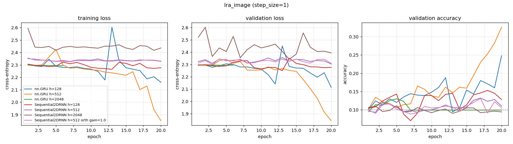

# lra_image — recurrent core comparison

Generated by `examples/lra_benchmark.py` from `image_wide/config.yaml`.

## Setup

| | |
| --- | --- |
| dataset | `lra_image` |
| sequence length | 1024 |
| features per timestep (`step_size`) | 1 |
| classes | 10 (chance = 0.100) |
| train / val / test | 8000 / 1000 / 1000 |
| epochs | 20 |
| batch size | 64 |
| learning rate | 0.001 (per-model overrides shown in the table) |
| gradient clip | 1.0 |
| device | cuda |

> ## READ THIS BEFORE USING THESE NUMBERS
>
> **This run does not answer the question it was built to ask.** Every row used
> `lr = 0.001`. Our train losses rose *above* chance ($\ln 10 = 2.3026$) and got
> monotonically worse with width — 2.2773, 2.3286, 2.4365 at $d_h$ 128 / 512 / 2048 —
> and `nn.GRU h=2048` diverged to NaN at epoch 7. Train loss above chance and
> worsening with width is the signature of too-large steps, not of a capacity
> limit: the same learning rate moves further in function space for a wider model.
>
> So the wide rows measure "wrong learning rate for this width", and the width
> question is **unanswered**. See `image_wide_lr/`, which crosses $d_h$ with `lr`.
>
> `nn.GRU h=2048` is a diverged run. Its 0.1300 / 0.1230 come from the last finite
> epoch before it broke and are **not** a result. This run predates divergence
> detection in the harness, so the row is not flagged in the table; later runs stop
> at the first non-finite loss and mark the row `DIVERGED@n`.
>
> Two things here *are* solid:
>
> - **Reproducibility.** `nn.GRU h=128` and `Sequential2DRNN h=128` reproduce
>   `image_full/` to four decimal places, across a fused cuDNN path and a 1024-step
>   Python loop. `nn.GRU h=512` further agrees with `image_wide_lr/` on every one of
>   its 20 epochs of validation accuracy.
> - **Cost is flat in width.** 30.1 / 29.6 / 29.3 s per epoch at $d_h$ = 128 / 512 /
>   2048: a 1.03x spread over a 16x width increase, against GRU's 0.5 -> 4.3 -> 19.7
>   (39x). This is Sec. 9.6 of `tasks/OVERVIEW_RNN_SEQUENTIAL_2D.md` confirmed under
>   real training rather than in a microbenchmark, and it is what makes
>   `image_wide_lr` affordable.
>
> And one negative result that is solid: **`orth gain=1.0` did nothing.** 0.1310
> against 0.1320 for default init. Combined with `gain=1.2` failing in
> `image_full/`, the orthogonal-initialisation hypothesis from
> `examples/rnn_internal_iterations.py` has now failed to transfer twice, at two
> different gains. It should be treated as unsupported at $L = 1024$ rather than as
> a fix awaiting the right gain, until someone measures the memory horizon on a
> *trained* model at this depth instead of at initialisation at $L = 20$.

## Results

Test accuracy is from the epoch with the best validation accuracy.
One seed. Validation and test splits are 1000 and 1000 rows, so the standard error at the best accuracy here (0.337) is about 0.015.

| model | params | lr | best val acc | test acc | epoch | wall clock | s / epoch (incl. val) |
| --- | ---: | ---: | ---: | ---: | ---: | ---: | ---: |
| nn.GRU h=128 | 51,594 | 0.001 | 0.2480 | 0.2300 | 20 | 9 s | 0.5 |
| nn.GRU h=512 | 796,170 | 0.001 | 0.3260 | 0.3370 | 20 | 86 s | 4.3 |
| nn.GRU h=2048 | 12,621,834 | 0.001 | 0.1300 | 0.1230 | 5 | 395 s | 19.7 |
| Sequential2DRNN h=128 | 17,930 | 0.001 | 0.1530 | 0.1630 | 18 | 601 s | 30.1 |
| Sequential2DRNN h=512 | 268,298 | 0.001 | 0.1320 | 0.1070 | 17 | 592 s | 29.6 |
| Sequential2DRNN h=2048 | 4,218,890 | 0.001 | 0.1110 | 0.0980 | 5 | 587 s | 29.3 |
| Sequential2DRNN h=512 orth gain=1.0 | 268,298 | 0.001 | 0.1310 | 0.1090 | 17 | 607 s | 30.3 |

## Per-epoch curves



## Config

```yaml
notes: "## READ THIS BEFORE USING THESE NUMBERS\n\n**This run does not answer the\
  \ question it was built to ask.** Every row used\n`lr = 0.001`. Our train losses\
  \ rose *above* chance ($\\ln 10 = 2.3026$) and got\nmonotonically worse with width\
  \ \u2014 2.2773, 2.3286, 2.4365 at $d_h$ 128 / 512 / 2048 \u2014\nand `nn.GRU h=2048`\
  \ diverged to NaN at epoch 7. Train loss above chance and\nworsening with width\
  \ is the signature of too-large steps, not of a capacity\nlimit: the same learning\
  \ rate moves further in function space for a wider model.\n\nSo the wide rows measure\
  \ \"wrong learning rate for this width\", and the width\nquestion is **unanswered**.\
  \ See `image_wide_lr/`, which crosses $d_h$ with `lr`.\n\n`nn.GRU h=2048` is a diverged\
  \ run. Its 0.1300 / 0.1230 come from the last finite\nepoch before it broke and\
  \ are **not** a result. This run predates divergence\ndetection in the harness,\
  \ so the row is not flagged in the table; later runs stop\nat the first non-finite\
  \ loss and mark the row `DIVERGED@n`.\n\nTwo things here *are* solid:\n\n- **Reproducibility.**\
  \ `nn.GRU h=128` and `Sequential2DRNN h=128` reproduce\n  `image_full/` to four\
  \ decimal places, across a fused cuDNN path and a 1024-step\n  Python loop. `nn.GRU\
  \ h=512` further agrees with `image_wide_lr/` on every one of\n  its 20 epochs of\
  \ validation accuracy.\n- **Cost is flat in width.** 30.1 / 29.6 / 29.3 s per epoch\
  \ at $d_h$ = 128 / 512 /\n  2048: a 1.03x spread over a 16x width increase, against\
  \ GRU's 0.5 -> 4.3 -> 19.7\n  (39x). This is Sec. 9.6 of `tasks/OVERVIEW_RNN_SEQUENTIAL_2D.md`\
  \ confirmed under\n  real training rather than in a microbenchmark, and it is what\
  \ makes\n  `image_wide_lr` affordable.\n\nAnd one negative result that is solid:\
  \ **`orth gain=1.0` did nothing.** 0.1310\nagainst 0.1320 for default init. Combined\
  \ with `gain=1.2` failing in\n`image_full/`, the orthogonal-initialisation hypothesis\
  \ from\n`examples/rnn_internal_iterations.py` has now failed to transfer twice,\
  \ at two\ndifferent gains. It should be treated as unsupported at $L = 1024$ rather\
  \ than as\na fix awaiting the right gain, until someone measures the memory horizon\
  \ on a\n*trained* model at this depth instead of at initialisation at $L = 20$.\n"
dataset:
  name: lra_image
  step_size: 1
  train_frac: 0.8
  val_frac: 0.1
  split_seed: 0
  embedding: null
training:
  epochs: 20
  batch_size: 64
  lr: 0.001
  grad_clip: 1.0
  seed: 0
  device: cuda
models:
- name: nn.GRU h=128
  type: gru
  hidden_size: 128
- name: nn.GRU h=512
  type: gru
  hidden_size: 512
- name: nn.GRU h=2048
  type: gru
  hidden_size: 2048
- name: Sequential2DRNN h=128
  type: sequential2d
  hidden_size: 128
  K: 1
- name: Sequential2DRNN h=512
  type: sequential2d
  hidden_size: 512
  K: 1
- name: Sequential2DRNN h=2048
  type: sequential2d
  hidden_size: 2048
  K: 1
- name: Sequential2DRNN h=512 orth gain=1.0
  type: sequential2d
  hidden_size: 512
  K: 1
  orthogonal_hh: true
  gain: 1.0
```
