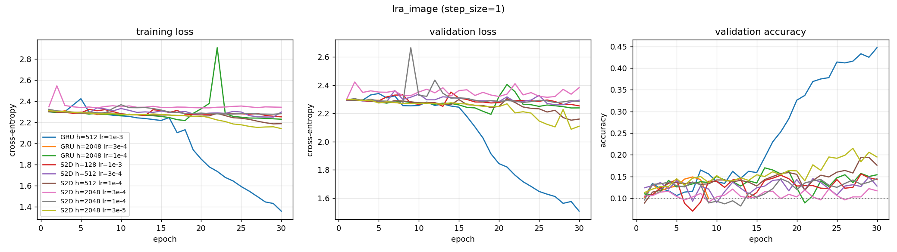

# lra_image — recurrent core comparison

Generated by `examples/lra_benchmark.py` from `image_wide_lr/config.yaml`.

## Setup

| | |
| --- | --- |
| dataset | `lra_image` |
| sequence length | 1024 |
| features per timestep (`step_size`) | 1 |
| classes | 10 (chance = 0.100) |
| train / val / test | 8000 / 1000 / 1000 |
| epochs | 30 |
| batch size | 64 |
| learning rate | 0.001 (per-model overrides shown in the table) |
| gradient clip | 1.0 |
| device | cuda |

> ## READ THIS BEFORE USING THESE NUMBERS
>
> **The lr grid is unequal across widths, so "best per width" is not a fair
> comparison.** $d_h$ 128 was run at one learning rate, 512 at two, 2048 at three.
> Taking the best row per width therefore favours the wider models purely because
> they had more attempts, and the grids do not overlap at $d_h = 128$ at all.
>
> Read only the **matched-lr** pairs, which say width *hurts*:
>
> - at lr 3e-4: h=512 gives 0.1490, h=2048 gives 0.1220
> - at lr 1e-4: h=512 gives 0.1940, h=2048 gives 0.1450
>
> Also note this run used 30 epochs where `image_wide/` used 20, so the two differ
> in two variables at once and neither alone explains the difference between them.
>
> Nearly every row here has its best epoch at or near 30, so the numbers are lower
> bounds. (This run predates `was_truncated()` in the harness, which now flags such
> rows automatically.)

## Results

Test accuracy is measured at the epoch with the best validation accuracy,
not at the last epoch.

| model | params | lr | best val acc | test acc | epoch | train time | s / epoch |
| --- | ---: | ---: | ---: | ---: | ---: | ---: | ---: |
| GRU h=512 lr=1e-3 | 796,170 | 0.001 | 0.4470 | 0.4800 | 30 | 155 s | 5.2 |
| GRU h=2048 lr=3e-4 **DIVERGED @9** | 12,621,834 | 0.0003 | 0.1490 | 0.1450 | 7 | 192 s | 21.3 |
| GRU h=2048 lr=1e-4 | 12,621,834 | 0.0001 | 0.1700 | 0.1750 | 16 | 614 s | 20.5 |
| S2D h=128 lr=1e-3 | 17,930 | 0.001 | 0.1560 | 0.1800 | 28 | 896 s | 29.9 |
| S2D h=512 lr=3e-4 | 268,298 | 0.0003 | 0.1490 | 0.1500 | 29 | 881 s | 29.4 |
| S2D h=512 lr=1e-4 | 268,298 | 0.0001 | 0.1940 | 0.1610 | 28 | 890 s | 29.7 |
| S2D h=2048 lr=3e-4 | 4,218,890 | 0.0003 | 0.1220 | 0.1210 | 29 | 875 s | 29.2 |
| S2D h=2048 lr=1e-4 | 4,218,890 | 0.0001 | 0.1450 | 0.1570 | 18 | 874 s | 29.1 |
| S2D h=2048 lr=3e-5 | 4,218,890 | 3e-05 | 0.2150 | 0.1710 | 27 | 873 s | 29.1 |

> **Divergence.** These models produced a non-finite loss and were stopped:
>
> - `GRU h=2048 lr=3e-4` at epoch 9
>
> Their `best val acc` and `test acc` come from the last finite epoch before divergence, so they are **not** results — they are whatever the model happened to reach before it broke. Lower the learning rate or tighten `grad_clip` and re-run before comparing them to anything.

### Reading the timings

Spread is 6x between fastest and slowest here. `torch.nn.RNN`/`LSTM`/`GRU` call fused cuDNN kernels covering a whole
sequence per launch; `Sequential2DRNN` runs a Python loop with a few
launches per timestep, because the block map is built to be inspected
rather than to be fast. **The gap is implementation, not architecture** —
do not read it as a property of the method.

## Per-epoch curves



## Config

```yaml
dataset:
  name: lra_image
  step_size: 1
  train_frac: 0.8
  val_frac: 0.1
  split_seed: 0
  embedding: null
training:
  epochs: 30
  batch_size: 64
  lr: 0.001
  grad_clip: 1.0
  seed: 0
  device: cuda
models:
- name: GRU h=512 lr=1e-3
  type: gru
  hidden_size: 512
  lr: 0.001
- name: GRU h=2048 lr=3e-4
  type: gru
  hidden_size: 2048
  lr: 0.0003
- name: GRU h=2048 lr=1e-4
  type: gru
  hidden_size: 2048
  lr: 0.0001
- name: S2D h=128 lr=1e-3
  type: sequential2d
  hidden_size: 128
  K: 1
  lr: 0.001
- name: S2D h=512 lr=3e-4
  type: sequential2d
  hidden_size: 512
  K: 1
  lr: 0.0003
- name: S2D h=512 lr=1e-4
  type: sequential2d
  hidden_size: 512
  K: 1
  lr: 0.0001
- name: S2D h=2048 lr=3e-4
  type: sequential2d
  hidden_size: 2048
  K: 1
  lr: 0.0003
- name: S2D h=2048 lr=1e-4
  type: sequential2d
  hidden_size: 2048
  K: 1
  lr: 0.0001
- name: S2D h=2048 lr=3e-5
  type: sequential2d
  hidden_size: 2048
  K: 1
  lr: 3.0e-05
```
