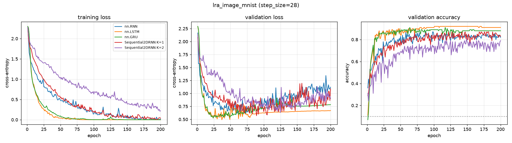

# lra_image_mnist — recurrent core comparison

Generated by `examples/lra_benchmark.py` from `mnist_smoke/config.yaml`.

## Setup

| | |
| --- | --- |
| dataset | `lra_image_mnist` |
| sequence length | 28 |
| features per timestep (`step_size`) | 28 |
| classes | 10 (chance = 0.100) |
| train / val / test | 800 / 100 / 100 |
| epochs | 200 |
| batch size | 64 |
| learning rate | 0.001 (per-model overrides shown in the table) |
| gradient clip | 1.0 |
| device | cuda |

> ## NOT A BENCHMARK, AND THE SPLITS ARE TINY
>
> `lra_image_mnist` is not part of Long Range Arena; it is the easy counterpart of
> `lra_image`, and its numbers belong in no table alongside it — different dataset,
> different sequence length (784 against 1024).
>
> The dataset holds 1000 rows, so validation and test are 100 rows each. Accuracy is
> therefore quantised to 0.01 with a standard error near 0.05: a 0.03 gap between two
> rows here is noise.
>
> "Easy" means *solvable*, not easy for every core. With 800 training rows and 784
> timesteps, `nn.GRU` reaches ~0.86 while `nn.RNN` and `nn.LSTM` stay at chance for
> the whole 200 epochs. A row at 0.11 here is not proof that its core is broken —
> `toy_bw_smoke` is the run that answers that question, and it is the one to read
> first when a row here is flat.

## Results

Test accuracy is from the epoch with the best validation accuracy.
One seed. Validation and test splits are 100 and 100 rows, so the standard error at the best accuracy here (0.950) is about 0.022.

| model | params | lr | best val acc | test acc | epoch | wall clock | s / epoch (incl. val) |
| --- | ---: | ---: | ---: | ---: | ---: | ---: | ---: |
| nn.RNN | 21,514 | 0.001 | 0.8700 | 0.8100 | 58 | 4 s | 0.0 |
| nn.LSTM | 82,186 | 0.001 | 0.9200 | 0.9500 | 101 | 4 s | 0.0 |
| nn.GRU | 61,962 | 0.001 | 0.9100 | 0.8800 | 64 | 4 s | 0.0 |
| Sequential2DRNN K=1 | 21,386 | 0.001 | 0.8700 | 0.9000 | 122 | 22 s | 0.1 |
| Sequential2DRNN K=2 | 21,386 | 0.001 | 0.8100 | 0.6600 | 149 | 35 s | 0.2 |

## Per-epoch curves



## Config

```yaml
notes: "## NOT A BENCHMARK, AND THE SPLITS ARE TINY\n\n`lra_image_mnist` is not part\
  \ of Long Range Arena; it is the easy counterpart of\n`lra_image`, and its numbers\
  \ belong in no table alongside it \u2014 different dataset,\ndifferent sequence\
  \ length (784 against 1024).\n\nThe dataset holds 1000 rows, so validation and test\
  \ are 100 rows each. Accuracy is\ntherefore quantised to 0.01 with a standard error\
  \ near 0.05: a 0.03 gap between two\nrows here is noise.\n\n\"Easy\" means *solvable*,\
  \ not easy for every core. With 800 training rows and 784\ntimesteps, `nn.GRU` reaches\
  \ ~0.86 while `nn.RNN` and `nn.LSTM` stay at chance for\nthe whole 200 epochs. A\
  \ row at 0.11 here is not proof that its core is broken \u2014\n`toy_bw_smoke` is\
  \ the run that answers that question, and it is the one to read\nfirst when a row\
  \ here is flat.\n"
dataset:
  name: lra_image_mnist
  step_size: 28
  max_points: null
  train_frac: 0.8
  val_frac: 0.1
  split_seed: 0
  embedding: null
  local: true
  data_dir: ../generatedata/data/processed
training:
  epochs: 200
  batch_size: 64
  lr: 0.001
  grad_clip: 1.0
  seed: 0
  device: cuda
models:
- name: nn.RNN
  type: rnn
  hidden_size: 128
- name: nn.LSTM
  type: lstm
  hidden_size: 128
- name: nn.GRU
  type: gru
  hidden_size: 128
- name: Sequential2DRNN K=1
  type: sequential2d
  hidden_size: 128
  K: 1
- name: Sequential2DRNN K=2
  type: sequential2d
  hidden_size: 128
  K: 2
```
