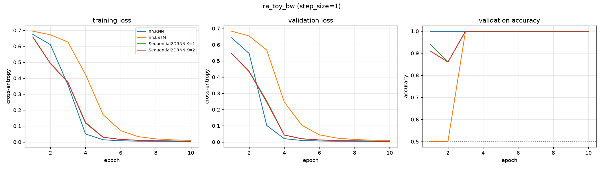

# lra_toy_bw — recurrent core comparison

Generated by `examples/lra_benchmark.py` from `toy_bw_smoke/config.yaml`.

## Setup

| | |
| --- | --- |
| dataset | `lra_toy_bw` |
| sequence length | 64 |
| features per timestep (`step_size`) | 1 |
| classes | 2 (chance = 0.500) |
| train / val / test | 800 / 100 / 100 |
| epochs | 10 |
| batch size | 64 |
| learning rate | 0.001 (per-model overrides shown in the table) |
| gradient clip | 1.0 |
| device | cuda |

> ## NOT A BENCHMARK
>
> `lra_toy_bw` is trivially separable by construction — two pixel levels 16 standard
> deviations apart. Accuracy near 1.0 means "this model is not broken", nothing more,
> and the ordering of the rows carries no information about the architectures.

## Results

Test accuracy is from the epoch with the best validation accuracy.
One seed. Validation and test splits are 100 and 100 rows, so the standard error at the best accuracy here (1.000) is about 0.000.

| model | params | lr | best val acc | test acc | epoch | wall clock | s / epoch (incl. val) |
| --- | ---: | ---: | ---: | ---: | ---: | ---: | ---: |
| nn.RNN | 1,186 | 0.001 | 1.0000 | 1.0000 | 1 | 0 s | 0.0 |
| nn.LSTM | 4,546 | 0.001 | 1.0000 | 1.0000 | 3 | 0 s | 0.0 |
| Sequential2DRNN K=1 | 1,154 | 0.001 | 1.0000 | 1.0000 | 3 | 2 s | 0.2 |
| Sequential2DRNN K=2 | 1,154 | 0.001 | 1.0000 | 1.0000 | 3 | 3 s | 0.3 |

## Per-epoch curves



## Config

```yaml
notes: "## NOT A BENCHMARK\n\n`lra_toy_bw` is trivially separable by construction\
  \ \u2014 two pixel levels 16 standard\ndeviations apart. Accuracy near 1.0 means\
  \ \"this model is not broken\", nothing more,\nand the ordering of the rows carries\
  \ no information about the architectures.\n"
dataset:
  name: lra_toy_bw
  step_size: 1
  max_points: null
  train_frac: 0.8
  val_frac: 0.1
  split_seed: 0
  embedding: null
  local: true
  data_dir: ../generatedata/data/processed
training:
  epochs: 10
  batch_size: 64
  lr: 0.001
  grad_clip: 1.0
  seed: 0
  device: cuda
models:
- name: nn.RNN
  type: rnn
  hidden_size: 32
- name: nn.LSTM
  type: lstm
  hidden_size: 32
- name: Sequential2DRNN K=1
  type: sequential2d
  hidden_size: 32
  K: 1
- name: Sequential2DRNN K=2
  type: sequential2d
  hidden_size: 32
  K: 2
```
