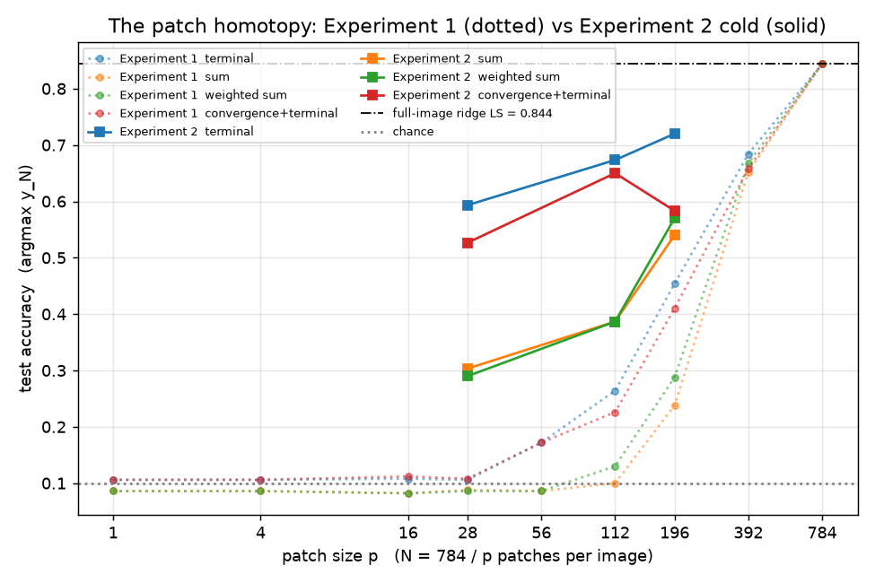
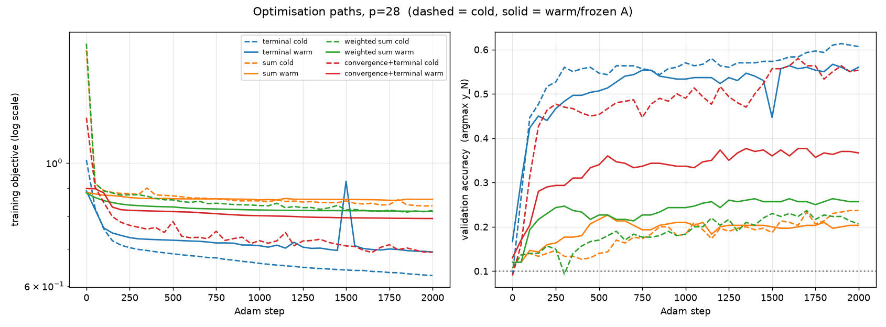
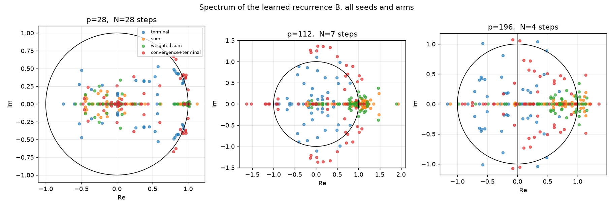
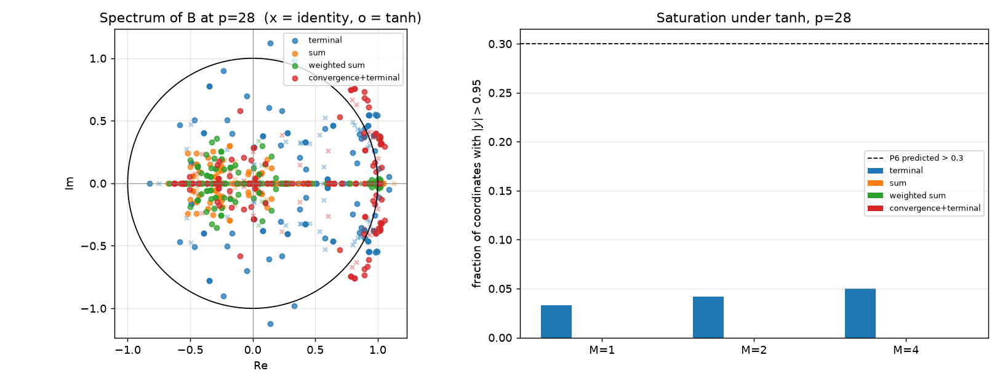
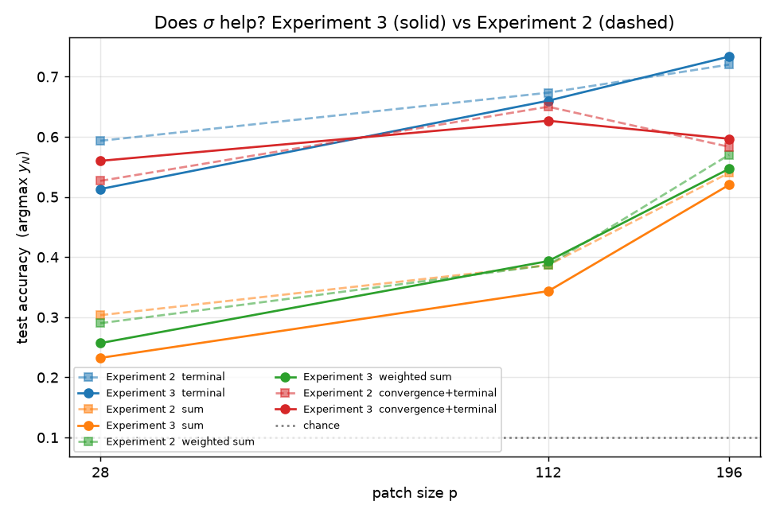
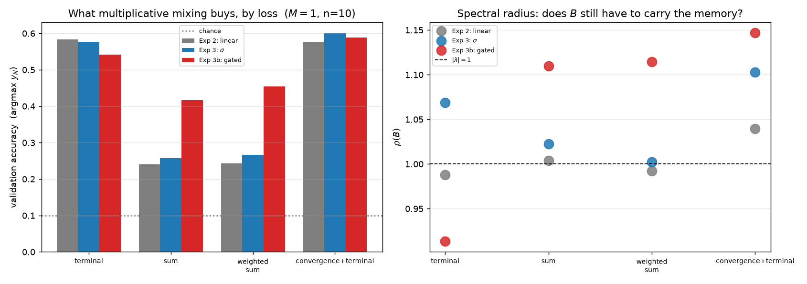
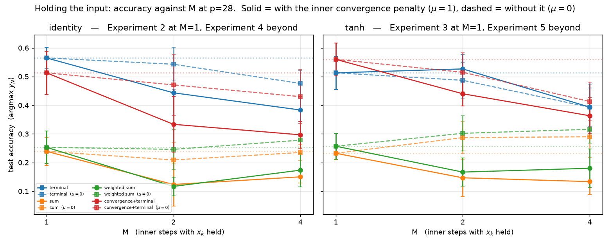
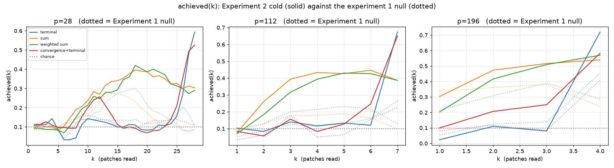
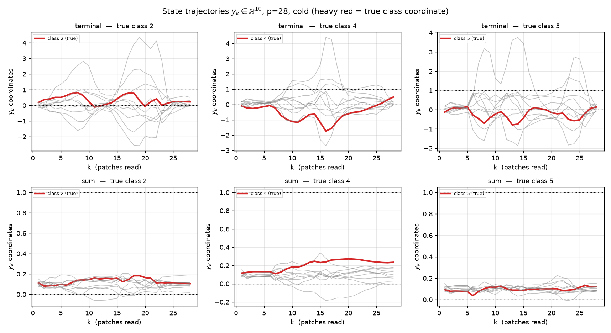

# Dynamical-system experiments

*The experiments of `tasks/RCP-ideas-dynamical-system.md`: a classification prediction
$y_k$ that is itself the state of a discrete dynamical system, built one experiment at a
time so each addition can be attributed.*

This is the single document for this line of work — design decisions, what was rejected,
results, figures, and how to re-run it. `RESEARCH_LOG.md` §6 carries the same results in
the project's chronological record.

---

## 1. Executive summary

| | |
| --- | --- |
| **What was run** | Experiments 1-5, four losses each, on `lra_image_mnist` and `lra_toy_bw`. 500 fits in total |
| **Headline** | MNIST at $p{=}28$ goes from **0.106 (chance) to 0.565** through a ten-dimensional state (n=10; the first three seeds said 0.593). Whole-image least squares is 0.844 |
| **Where the gain is** | **All of it is in Experiment 2** — letting $y$ carry information between patches. Experiments 3, 4 and 5 add nothing measurable |
| **Largest effect** | **Genuine multiplicative mixing** (Experiment 3b, §5.1): $+0.160$ and $+0.187$ validation for the trajectory losses at 5.5 and 8.2 se, at $M{=}1$. Experiment 3's separable $\sigma$ bought nothing — its null meant *we had not tested mixing* |
| **Biggest surprise** | The four losses differ **in kind, not degree**: two give a running estimate, two give a state that is at or below chance until the final step. That classification has since predicted the sign of three separate interventions |
| **Best diagnostic** | Leading $\lvert\lambda(B)\rvert = \mathbf{0.999}$ over 24 runs — a near-identity memory path, learned with no gating in the architecture |
| **Strongest result** | Experiment 4 with linear $f$ is a strict **subset** of Experiment 2 — five lines of algebra, then confirmed empirically with **zero violations in 8 comparisons** |
| **Biggest correction** | "Holding the input hurts" was **our own penalty, not the dynamics.** Removing the inner convergence term recovers a median **88%** of the loss; $\mu{=}0$ rows reach or beat their $M{=}1$ value in 6 of 16 cells against 0 of 16 with it on |
| **Best positive result** | Holding the input pays when the map is **nonlinear and** the loss asks for a running answer: $\tanh$ + weighted sum gains **+0.076** validation (+3.2 se, n=10). The loss sets the sign (7 of 8 cells, both activations); the nonlinearity sets the size. Under terminal loss with a linear map it reaches −0.127 |
| **Mechanism** | The penalty crushes $\rho(B)$ from ~1.00 to **0.62-0.70** for sum and weighted sum. Settling fast needs a contraction; a contraction destroys the near-integrator the memory depends on. **Convergence and memory are in direct tension** |
| **If you add one thing** | **The gate** (§5.1): $+0.187$ validation, no inner iterations, no extra sequential depth, no $\mu$ to tune. Gating and holding the input are partly substitutes — their gains are sub-additive, their harms exactly additive (§7.2) |
| **Biggest limit** | 100-row test split, $\mathrm{se}\approx0.049$. **Test accuracy disagreed with validation on three separate deltas today, and validation was right each time.** Nothing under ~0.14 is readable from test alone |

**Read §10 first if you read one section.** Five predictions were registered before the
Experiment 3-5 sweep and scored afterwards; one landed numerically and is still scored a
miss, which is the most useful thing in this document.

§2 [setup](#2-setup) · §3 [Experiment 1](#3-experiment-1) · §4 [Experiment 2](#4-experiment-2) ·
§5 [Experiment 3](#5-experiment-3) · §6 [Experiment 4](#6-experiment-4) · §7 [Experiment 5](#7-experiment-5) ·
§8 [what the losses do](#8-what-the-four-losses-do) · §9 [settled on paper](#9-settled-before-running-no-compute) ·
§10 [corrections and how the predictions scored](#10-corrections) ·
§11 [design decisions and what was rejected](#11-design-decisions-and-what-was-rejected) ·
§12 [how to re-run this](#12-how-to-re-run-this) · §13 [not established, and deferred](#13-not-established-and-deferred).

Design record, results, figures and re-run instructions are all in this one document;
`RESEARCH_LOG.md` §6 carries the same results in the project's chronological record.

**Next round:** `tasks/NEXT_STEPS_DYNAMICAL_SYSTEM.md` — extending to the other LRA datasets, written to hand to a fresh assistant. Its premise is that MNIST is too nearly-linearly-separable (whole-image least squares reaches 0.844) to show what extra iterations buy.

---

## 2. Setup

**The object.** State is a vector, and the prediction is part of it:

$$z_k = \begin{bmatrix} x_k \\ y_k \\ h_k \end{bmatrix}$$

$k$ indexes patches **within one image** — $x_k \in \mathbb{R}^p$ is patch $k$, and
$y_k \in \mathbb{R}^{C}$ is the running guess, which **is** the prediction: there is no
readout head. $y_0 = 0$ and is excluded from every loss (a constant: fixed penalty, zero
gradient). $h_k$ is internal state and appears only at Experiment 6.

**Patch size $p$ is the swept axis, and it is the object of study.** At $p=1$ Experiment 1
sees a single pixel; at $p=784$ it is $N=1$ and Experiment 1 becomes *exactly* ridge
regression on the flattened image. Only divisors of the feature count are usable —
`generatedata`'s `load_data_as_sequence` raises on a non-divisor (`load_data.py:297`), so
this is enforced rather than silent.

This is not the `step_size`-as-cost-dial error of `PRINCIPLES.md` §2.8, which forbids using
it to make a run *cheaper*, because it changes the task; here the task change is the thing
being studied, and cost is bought with `max_points` as `PRINCIPLES.md` §2.8 requires.

**The four losses**, all as **norms against one-hot**, not cross-entropy — the inequalities
relating them are triangle inequalities, and cross-entropy is not a metric:

$$T=\lVert y_N-t\rVert,\quad S=\sum_k\lVert y_k-t\rVert,\quad
\sum_k \lambda_k\lVert y_k-t\rVert\ (\lambda_k\!\propto\!k),\quad T+V,\ \
V=\sum_k\lVert y_{k+1}-y_k\rVert$$

$\lambda_k \propto k$ because after $k$ patches the model has seen $k/N$ of the evidence, so
the weight tracks what is answerable. **$V$ is never used alone: its global minimum is the
identity map** — do nothing, converge perfectly, score zero — so it carries no information
about the task and can only trade against correctness. It is measured as an instrument and
optimised only paired with a fit term.

**Data.** `lra_image_mnist` and `lra_toy_bw`, 1000 rows each as shipped, split 0.8/0.1/0.1
under a fixed permutation. Experiment 1 is closed form and uses 5 split seeds; Experiment 2
uses 3, full-batch Adam, 2000 steps, lr 3e-3, best-on-validation weights.

---

## 3. Experiment 1 — $y_{k+1} = A x_k + b$

**Design.** No recurrence, so $y_N$ depends on $x_{N-1}$ alone. Every loss is quadratic in
$(A,b)$, so there is **no optimiser and no epoch budget** — each number is the exact
minimiser given its split. The convergence term is

$$V_2 = \sum_k \lVert A(x_k - x_{k-1})\rVert^2 = \operatorname{tr}(A\,C_\Delta A^\top),
\qquad C_\Delta = \sum_k (x_k-x_{k-1})(x_k-x_{k-1})^\top$$

— **generalised Tikhonov whose metric is the patch-difference covariance.** In the linear
case "convergence loss" *is* smoothness regularisation, exactly. Ridge $\alpha$ is tuned on
validation separately at each $p$, because otherwise $\alpha$ and $p$ move together and the
patch sweep is a `PRINCIPLES.md` §2.3 confound; selection is on terminal validation accuracy for every loss
alike, so the criterion is not itself an axis.

**Both controls pass.**

- `lra_toy_bw`: **1.000 ± 0.000 at every patch size from 1 to 64, all four losses.** One
  pixel separates a dark image from a bright one — the positive control.
- `lra_image_mnist` at $p{=}1$: **0.106 ± 0.030** against chance 0.100 — the negative control.

| $p$ | $N$ | terminal | sum | weighted sum | convergence+terminal |
| ---: | ---: | ---: | ---: | ---: | ---: |
| 1 | 784 | 0.106 | 0.086 | 0.086 | 0.106 |
| 4 | 196 | 0.106 | 0.086 | 0.086 | 0.106 |
| 16 | 49 | 0.108 | 0.082 | 0.082 | 0.112 |
| 28 | 28 | 0.106 | 0.088 | 0.086 | 0.108 |
| 56 | 14 | 0.172 | 0.086 | 0.086 | 0.172 |
| 112 | 7 | 0.264 | 0.100 | 0.130 | 0.226 |
| 196 | 4 | 0.454 | 0.238 | 0.288 | 0.410 |
| 392 | 2 | 0.684 | 0.652 | 0.668 | 0.658 |
| 784 | 1 | **0.844** | **0.844** | **0.844** | **0.844** |

> **[stat]**, 5 split seeds, 100 test rows. $\mathrm{se}=\sqrt{p(1-p)/100}$ is **0.030** at
> $p\approx0.1$ and **0.036** at $p\approx0.84$, so differences within a row below ~0.10
> are not resolvable. Splits share data, so these are not independent replicates.

At $p{=}784$, $N{=}1$: there is no trajectory to weight, so all four losses **must** coincide
**[det]** — and they do, to three decimals. A free implementation check.

**`achieved(k)` here is the null for everything that follows.** Experiment 1 cannot
accumulate, so its curve measures "classify from patch $k$". It is not flat but a **hump**
tracking where the ink is, returning to chance at the bottom of the image — the dotted
curves in §8. Experiment 2's signal is a *monotone rise against that shape*, not merely
"above chance".

---

## 4. Experiment 2 — $y_{k+1} = A x_k + B y_k + b$

**Design.** One term added. Unrolling with $y_0 = 0$ shows what the model class is:

$$y_N = \sum_k B^{\,N-1-k}A\,x_k = \big[\,B^{N-1}A \;\; B^{N-2}A \;\cdots\; A\,\big]\,
\mathrm{vec}(\text{image})$$

— full least squares on the flattened image **constrained to companion/Krylov structure**,
$Cp + C^2$ parameters standing in for a $C \times Np$ map. At $p=784$, $N=1$, it degenerates
to full least squares exactly, which is the far end of the patch sweep.

Each configuration runs **cold** (everything random) and **warm** (Experiment 1's exact
solution for the same loss, patch size and split, **frozen**, with $B$ starting at zero — so
it begins life *being* Experiment 1, and anything it gains is attributable to $B$).

| $p$ | $N$ | arm | terminal | sum | weighted sum | convergence+terminal |
| ---: | ---: | --- | ---: | ---: | ---: | ---: |
| 28 | 28 | Experiment 1 | 0.106 | 0.088 | 0.086 | 0.108 |
| 28 | 28 | cold | **0.593 ± 0.005** | 0.303 ± 0.021 | 0.290 ± 0.000 | 0.527 ± 0.106 |
| 28 | 28 | warm | 0.487 ± 0.029 | 0.223 ± 0.005 | 0.320 ± 0.051 | 0.373 ± 0.021 |
| 112 | 7 | Experiment 1 | 0.264 | 0.100 | 0.130 | 0.226 |
| 112 | 7 | cold | **0.673 ± 0.012** | 0.387 ± 0.017 | 0.387 ± 0.021 | 0.650 ± 0.059 |
| 112 | 7 | warm | 0.510 ± 0.078 | 0.407 ± 0.026 | 0.373 ± 0.012 | 0.523 ± 0.038 |
| 196 | 4 | Experiment 1 | 0.454 | 0.238 | 0.288 | 0.410 |
| 196 | 4 | cold | **0.720 ± 0.022** | 0.540 ± 0.024 | 0.570 ± 0.036 | 0.583 ± 0.021 |
| 196 | 4 | warm | 0.657 ± 0.063 | 0.457 ± 0.034 | 0.490 ± 0.024 | 0.563 ± 0.021 |

> **[stat]**, 3 split seeds, 100 test rows, $\mathrm{se}\approx0.049$ near $p=0.6$, so a
> single matched pair needs ~0.14 to resolve. **Chance → 0.593 is about 10 se and is not in
> doubt. Cold-vs-warm at ~0.10 is not resolved by any single cell** — see below.

> **The $p{=}28$ cold row has since been re-measured at ten seeds** (it is the same
> configuration as Experiment 4 at $M{=}1$). Test / validation:
>
> | loss | 3 seeds | **10 seeds** | shift |
> | --- | ---: | ---: | ---: |
> | terminal | 0.593 / 0.623 | **0.565 / 0.583** | -0.028 / -0.040 |
> | sum | 0.303 / 0.253 | **0.239 / 0.241** | -0.064 / -0.012 |
> | weighted sum | 0.290 / 0.247 | **0.253 / 0.243** | -0.037 / -0.004 |
> | convergence+terminal | 0.527 / 0.593 | **0.513 / 0.575** | -0.014 / -0.018 |
>
> The headline is unaffected — chance 0.106 → **0.565** is still about 10 se — but the
> three-seed estimates were optimistic by up to 0.064, and **every other row in this table
> is still at three seeds**, so it is good to ±0.03 typical, ±0.06 worst case (§10.1).


A ten-dimensional state carrying information across 28 patches recovers 0.565 of the 0.844
available to a model that sees the whole image at once.



Experiment 1 dotted, Experiment 2 cold solid. The gain is largest at **small $p$** — more
patches, more for $B$ to do. Experiment 2 was run at three of the nine patch sizes.

**Cold beats warm in 10 of 12 matched cells. [stat]** Each gap is 1–3 se, so the evidence is
the *consistency* and the cells are not independent. Reading: an $A$ fitted to classify from
one patch alone is the **wrong $A$** once $B$ can carry information, so freezing it starts
the model in a basin it cannot leave. This is what Experiment 6 was going to ask, arriving
at Experiment 2.

> **Weakened by what was learned later.** This rests on 12 cells at **three seeds**, and
> §10.1 measures a three-seed estimate as moving by a mean of 0.027 and a max of 0.064 when
> taken to ten — with paired differences no more stable than absolute numbers. The
> cold-vs-warm gaps here are 0.06-0.16, i.e. **the same size as the noise**. The sign
> pattern across 12 cells is still the evidence, but it is weaker evidence than the
> "1-3 se" framing above suggests, and this comparison has **not** been re-run at ten seeds.




The optimiser is not the explanation for any of the above: objectives and validation
accuracy plateau by step 500–750 of 2000. The four objectives are different functionals and
are **not comparable across colours** — read the left panel within a colour. One exception
matters: terminal/cold is still climbing at 2000, so **0.565 is a lower bound** on what that
configuration reaches.

**The learned recurrence. [det] per run, averaged over 24.** $B$ is $10\times10$, so the
whole spectrum can simply be looked at, which at $d_h = 2048$ it never could. At $N{=}28$,
mean sorted $\lvert\lambda\rvert$:

    0.999   0.970   0.884   |   0.674  0.450  0.336  0.286  0.208  0.161  0.079



A **near-integrator at 0.999** plus two slow modes, a clear gap, then a fast-decaying bulk.
The model builds a near-identity path for itself with no gating in the architecture — the
mechanism `RESEARCH_LOG.md` §5 item 1 hypothesises gates supply, arriving unforced. At
$N{=}7$ and $N{=}4$ eigenvalues sit *outside* the unit circle: $\lvert\lambda\rvert^N$ only
bites when $N$ is large, so **sequence length pins the spectrum, not the loss.**

---

## 5. Experiment 3 — $y_{k+1} = \sigma(A x_k + B y_k + b)$

**Design.** One variable moves from Experiment 2: an elementwise $\sigma = \tanh$ on the
recurrence, which makes the map exactly `nn.RNN` at $d_h = C$. The *parameters are
unchanged* — same $A$, $B$, $b$. Targets stay one-hot (§11.7) and the runs are cold only
(§11.8), both for reasons recorded there.

**Result: no resolvable effect.** Test accuracy, Experiment 2 → Experiment 3:

| $p$ | $N$ | terminal | sum | weighted sum | convergence+terminal |
| ---: | ---: | ---: | ---: | ---: | ---: |
| 28 | 28 | 0.593 → 0.490 (-0.103) | 0.303 → 0.233 (-0.070) | 0.290 → 0.277 (-0.013) | 0.527 → 0.550 (+0.023) |
| 112 | 7 | 0.673 → 0.660 (-0.013) | 0.387 → 0.343 (-0.043) | 0.387 → 0.393 (+0.007) | 0.650 → 0.627 (-0.023) |
| 196 | 4 | 0.720 → 0.733 (+0.013) | 0.540 → 0.520 (-0.020) | 0.570 → 0.547 (-0.023) | 0.583 → 0.597 (+0.013) |

> **[stat]**, 3 split seeds, 100 test rows. The largest delta, −0.103, is ~1.5 se on a
> single split. **Do not read these deltas**: see below.

**Why they must not be read.** At $p{=}28$ the training objectives agree within 3%
(0.626 vs 0.610 for terminal) and the validation accuracies within 0.013 (0.623 vs 0.613),
while test accuracy claims a 0.103 gap. Two of three measures say the models are
equivalent. **The test deltas are noise**, and they were reported as real for about an hour
before the other two measures contradicted them — see §10.1, P1, which is scored a miss
despite landing numerically.

**What does survive, and it is [det].** $\tanh$ reaches the same training objective and the
same validation accuracy with **half the state amplitude**:

| mean $\lVert y_k\rVert$ at $p{=}28$ | terminal | sum | weighted sum | conv+terminal |
| --- | ---: | ---: | ---: | ---: |
| identity | 2.317 | 0.383 | 0.374 | 0.444 |
| $\tanh$ | **1.214** | 0.383 | 0.381 | 0.576 |

Two things follow. The losses that already lived inside $\tanh$'s linear region are
untouched to three decimals — the nonlinearity is simply inactive for them. And the
large-amplitude regime terminal loss builds under identity is **available rather than
necessary**: the same fit is reachable at half the amplitude. Saturation is 0.027 for
terminal and exactly 0.000 for sum and weighted sum, so nothing is pressing the rails;
the optimiser declines to go there rather than being stopped.



Left: $\tanh$ barely moves the spectrum at $N{=}28$ (registered prediction P3, §10.1 —
weakly supported, one loss of four). Right: saturation against the 0.3 that P6 predicted.
**P6 is refuted by a wide margin**, which is why the design record's original plan to rescale
targets into $\sigma$'s interior was withdrawn (§11.7): there is nothing to rescale away.



**Why this null is not evidence that $\sigma$ is useless — §7.1 settles it.** At $M{=}1$ the
map is applied once per patch and the state never iterates toward $\sigma$'s fixed point.
**$\sigma$'s value lies in that fixed point**, and §7.1 shows it is worth up to $+0.076$ as
soon as the input is held. So Experiment 3's null and Experiment 5's gain are the same fact
seen from two sides: a nonlinearity you never iterate is a nonlinearity you have not used.

**The limit was recorded before this ran, and it now binds.** §11.6 states that Experiment
3's pre-activation is *separable* — $x$ and $y$ are added then squashed, never multiplied —
so a null here **cannot** distinguish "joint mixing does not help" from "we never tested
joint mixing". Experiment 3b, the non-separable $(Cx_k)\odot(Dy_k)$ gated form, is the
follow-up that would.

### 5.1 Experiment 3b — genuine multiplicative mixing, and the largest effect in this work

$$y_{k+1} = \sigma(Ax_k + By_k + b) \;+\; (Cx_k)\odot(Dy_k)$$

The only map here in which $x$ and $y$ actually **multiply**. §11.6 recorded, before any of
this ran, that Experiment 3's separable pre-activation meant its null could not distinguish
"joint mixing does not help" from "we never tested joint mixing". This tests it.

$C$ is initialised to zero so the gate is inert and the model *contains* Experiment 3 exactly.
$D$ is **not** also zeroed: $\partial[(Cx)\odot(Dy)]/\partial C = x\odot(Dy)$ vanishes
identically at $D=0$, so zeroing both would leave the term dead with no path to grow — and
would have produced a meaningless null. Verified: gate inert at init, gradient live at init.

$p{=}28$, $M{=}1$, ten seeds, test / validation:

| loss | Exp 2 (linear) | Exp 3 ($\sigma$) | **Exp 3b (gated)** | 3b − 3, validation | $\rho(B)$ |
| --- | ---: | ---: | ---: | ---: | ---: |
| sum | 0.239 / 0.241 | 0.232 / 0.257 | **0.396 / 0.417** | **+0.160** (+5.5 se) | 1.02 → 1.11 |
| weighted sum | 0.253 / 0.243 | 0.251 / 0.267 | **0.414 / 0.454** | **+0.187** (+8.2 se) | 1.00 → 1.11 |
| terminal | 0.565 / 0.583 | 0.520 / 0.577 | **0.511 / 0.541** | **-0.036** (-1.4 se) | 1.07 → 0.91 |
| convergence+terminal | 0.513 / 0.575 | 0.563 / 0.600 | **0.533 / 0.589** | **-0.011** (-0.3 se) | 1.10 → 1.15 |



Left: what multiplication buys, by loss. Right: the spectral radius of the learned $B$ —
plotted as points, not bars, because for $\rho$ what matters is **distance from 1**, and a
bar from zero makes 0.91 and 1.11 look alike when they mean opposite things.

**Joint mixing is transformative for the trajectory losses and does nothing for the
terminal ones.** $+0.160$ and $+0.187$ at 5.5 and 8.2 se are the largest and most
significant effects anywhere in this study — and they arrive at $M{=}1$, with no inner
iterations. Experiment 3's null meant we had not tested mixing, exactly as §11.6 warned.

**The same loss split appears a third time**, now in a third map and at far greater
magnitude: the losses whose `achieved(k)` rises and holds gain; the ones that spike at the
last step do not. That classification (§8) has now predicted the sign of three separate
interventions — $\sigma$, holding the input, and gating.

**A mechanism change visible only in the spectrum.** Terminal loss gains nothing in accuracy
(−1.4 se) while its $\rho(B)$ drops **1.07 → 0.91**, off the unit circle. Experiment 2 pins
$\rho\approx0.999$ because a near-identity path is the only way to carry memory 28 steps;
the gate supplies an input-dependent path instead, so $B$ is relieved of the job. **That is
`RESEARCH_LOG.md` §5 item 1's gating hypothesis observed directly** — and it shows up as a
change of mechanism at unchanged performance, which accuracy alone would not reveal.

**Worth weighing, and not a decision a number can make.** Terminal loss still gives the
highest absolute accuracy (0.583). But gated weighted sum reaches 0.454 *while being a
genuine running predictor at every step*, where the terminal model sits at or below chance
until the final patch (§8). Which is preferable depends on what the system is for.

---

## 6. Experiment 4 — Experiment 2 with $x_k$ held for $M$ inner steps

**Design.** A **control, not an experiment** (§9): with linear $f$ the model class is a
strict subset of Experiment 2's, so inner iterations cannot buy representational power and
a win here would mean a bug. Inner steps carry only the convergence term; the last inner
step of each outer read carries the fit term.

**P4 confirmed — zero violations in eight comparisons**, on test *and* validation:

| loss | $M=1$ | $M=2$ | $M=4$ |
| --- | ---: | ---: | ---: |
| terminal | 0.593 / 0.623 | 0.443 / 0.540 | 0.383 / 0.480 |
| sum | 0.303 / 0.253 | 0.123 / 0.153 | 0.150 / 0.137 |
| weighted sum | 0.290 / 0.247 | 0.117 / 0.160 | 0.173 / 0.157 |
| convergence+terminal | 0.527 / 0.593 | 0.333 / 0.417 | 0.297 / 0.370 |

> test / validation, 3 split seeds, $p{=}28$. Margins of 0.08-0.18 on validation, far
> outside the noise that made Experiment 3 unreadable. $M{=}1$ reproduces Experiment 2
> **bit-identically** across all 12 matched runs — a different script, a different model
> class, agreeing to 0.00e+00 on test accuracy, validation accuracy and $\rho(B)$ to nine
> decimals.



**The attribution, resolved.** Raising $M$ moved two things at once
(`PRINCIPLES.md` §2.3): the model class shrank to a strict subset, *and* an
inner-convergence penalty switched on that was identically zero at $M{=}1$. The $\mu = 0$
rows hold the penalty at nothing so the containment alone remains. **Validation accuracy,
three seeds:**

| loss | $M{=}1$ | $M{=}2$: $\mu{=}1$ → $\mu{=}0$ | $M{=}4$: $\mu{=}1$ → $\mu{=}0$ |
| --- | ---: | ---: | ---: |
| terminal | 0.623 | 0.540 → **0.600** (72%) | 0.480 → **0.563** (58%) |
| sum | 0.253 | 0.153 → **0.173** (20%) | 0.137 → **0.257** (103%) |
| weighted sum | 0.247 | 0.160 → **0.260** (115%) | 0.157 → **0.300** (159%) |
| convergence+terminal | 0.593 | 0.417 → **0.503** (49%) | 0.370 → **0.513** (64%) |

**Most of the damage was the penalty, not the holding.** Across Experiments 4 and 5 the
median validation recovery is **88%** (mean 91%, range 17-183%), and $\mu{=}0$ rows reach
or beat their own $M{=}1$ value in **6 of 16** cells — against **0 of 16** with the penalty
on. So the corrected claim is: **holding the input is roughly neutral; penalising it for
not settling costs 0.12-0.15 accuracy.**

**The mechanism, measured.** For sum and weighted sum the penalty crushes $\rho(B)$ from
~1.00 to **0.62-0.70**, and removing it restores ~1.05. Settling fast requires a strict
contraction, and a contraction destroys precisely the near-integrator that Experiment 2's
memory depends on (§4). **Convergence and memory are in direct tension.** For terminal and
convergence+terminal, $\rho$ stays near 1 in every condition, so the penalty damages those
by some other route — one mechanism does not cover all four losses. A candidate: the inner
gap is $\lVert (B-I)y + Ax\rVert$, which can also be made small by keeping $B \approx I$
and starving $\lVert A \rVert$. That needs $\lVert A\rVert$, which was not recorded for
these runs; it is recorded now, so a re-run would settle it.


**Unresolved, and the cheapest next thing to run.** With $\mu{=}0$ the best cell —
$\tanh$ with weighted sum — rises monotonically: validation 0.260 at $M{=}1$, 0.317 at
$M{=}2$, 0.340 at $M{=}4$, with test agreeing in direction. But the spread across seeds is
0.05-0.08, so a +0.08 effect is about one standard deviation. **Whether holding the input
actually *helps*, rather than merely not hurting, is not resolved by three seeds.**

One further caution found while reading this table: **the training objective is not
comparable across $M$**, because the inner-convergence term is identically zero at $M{=}1$
and non-negative beyond it, so a higher total there is partly an extra term rather than a
worse fit. Validation accuracy is the clean cross-$M$ measure.

---

## 7. Experiment 5 — Experiment 3 with $x_k$ held for $M$ inner steps

**Design.** The one corner where holding the input can do something a single step cannot:
with $\sigma$ in the loop the state settles toward a **nonlinear** fixed point
$y^\ast = \sigma(Ax + By^\ast + b)$, strictly more expressive than the linear
$y^\ast = (I-B)^{-1}Ax$ that Experiment 4 is confined to (§9). $M{=}1$ reproduces
Experiment 3 at $p{=}28$ **bit-identically** across all 12 matched runs — the second
built-in control.

**Result: it does not help.** Test / validation accuracy, $p{=}28$:

| loss | $M=1$ | $M=2$ | $M=4$ |
| --- | ---: | ---: | ---: |
| terminal | 0.490 / 0.613 | 0.527 / 0.563 | 0.393 / 0.447 |
| sum | 0.233 / 0.260 | 0.147 / 0.140 | 0.133 / 0.127 |
| weighted sum | 0.277 / 0.260 | 0.167 / 0.163 | 0.180 / 0.163 |
| convergence+terminal | 0.550 / 0.603 | 0.440 / 0.503 | 0.363 / 0.443 |

> **[stat]**, 3 split seeds, 100 test rows. **Zero of sixteen rows across Experiments 4
> and 5 beat their own $M{=}1$ value on validation.** One beats it on test — tanh
> terminal at $M{=}2$, 0.527 against 0.490 — and that same row reads 0.563 against 0.613
> on validation. Do not read it.

**So the nonlinearity does not rescue inner iterations.** That is the informative part:
$\sigma$ was the ingredient that could in principle have made holding the input pay, and
with it in place the damage is of the same order as without. Comparing the drop from each
experiment's own $M{=}1$ row, the difference-in-differences between tanh and identity is
+0.107 on test but only **+0.020 on validation**, consistent in 2 of 4 losses. The weaker
claim — "$\sigma$ reduces the damage" — is unresolved; the stronger one, that it helps, is
refuted.

**The attribution is resolved in §6, and it changes this section's headline.** Every row in the table above ran at $\mu = 1$. With the inner penalty removed, median validation recovery across Experiments 4 and 5 is 88%, and Experiment 5 recovers 87-159% at $M{=}2$ on all four losses. **"Holding the input hurts" is an artefact of a penalty we put in the objective**, not a property of the dynamics.

**And an instrument that should have existed from the start.** The stated purpose of
holding $x_k$ is that $y$ *converges* while it is held, and none of the runs above measure
whether it does. The convergence term went into the objective and was never read back off
held-out data. `inner_gap` (mean $\lVert y_{k,j+1}-y_{k,j}\rVert$) and
`first_to_last_inner_gap` ($\lVert y_{k,M}-y_{k,1}\rVert$) were added afterwards and
are recorded for the $\mu=0$ rows only. Read together they separate two failure modes that
look identical in accuracy: a state already at rest, where the inner steps do nothing, and
a state drifting steadily, where it never settles. Backfilling the $\mu=1$ rows costs about
50 minutes and is **deferred to RCP**.

---

### 7.1 The loss sets the sign; the nonlinearity sets the size

Change in **validation** accuracy from each arm's own $M{=}1$ row, at $\mu{=}0$, **ten seeds
in every cell**; parentheses are se multiples.

| loss | `achieved(k)` shape (§8) | identity $M{=}2$ | identity $M{=}4$ | $\tanh$ $M{=}2$ | $\tanh$ $M{=}4$ |
| --- | --- | ---: | ---: | ---: | ---: |
| sum | rise and hold | -0.022 (-0.9) | +0.016 (+0.7) | +0.055 (+1.9) | +0.075 (+2.8) |
| weighted sum | rise and hold | +0.014 (+0.6) | +0.037 (+1.7) | +0.074 (+3.3) | +0.076 (+3.2) |
| terminal | flat then spike | -0.004 (-0.2) | -0.055 (-2.2) | -0.047 (-1.7) | -0.117 (-3.5) |
| convergence+terminal | flat then spike | -0.067 (-2.1) | -0.127 (-2.7) | -0.057 (-2.4) | -0.162 (-5.9) |

Two separate things are happening, and separating them took the ten-seed control.

**The loss type sets the sign, under both activations — 7 of 8 cells.** Losses whose
`achieved(k)` rises and holds are non-negative; losses that sit at chance and spike at the
last step are negative. The single exception, identity/sum at $M{=}2$, is $-0.9$ se, i.e.
nothing. That classification comes from §8, measured at $M{=}1$ before any of these runs
existed, and is not fitted to this result.

**The nonlinearity sets the magnitude.** With $\tanh$ the trajectory-loss gains reach
$+0.075$ at 2.8-3.3 se; with the identity map they reach only $+0.037$ and never clear
1.7 se. The terminal-type losses are hurt about twice as hard with $\sigma$ as without.

**Why, from §9 rather than from the table.** With linear $f$ the held-input fixed point is
$y^\ast=(I-B)^{-1}Ax$ — a linear map of $x$, **reachable in one step** — which is the same
fact as linear Experiment 4 being a strict subset of Experiment 2 (§6). Iterating toward it
can only sharpen what a one-step model already represents, so the gain is small. With
$\sigma$, $y^\ast=\sigma(Ax+By^\ast+b)$ is not reachable by any one-step linear model, so
settling toward it is genuinely new computation and the gain is measurable.

**So the practical claim is conjunctive.** Holding $x_k$ pays when the map is nonlinear
**and** the loss asks for a running answer. Drop either and it does nothing measurable or
hurts. **Under terminal loss with a linear map — the two most natural defaults, and what
`examples/lra_benchmark.py` uses — holding the input is a straight loss**, reaching
$-0.127$ at $M{=}4$.

> **This section was rewritten twice as the controls arrived, and both intermediate
> readings were wrong.** From Experiment 5 alone it read as loss-driven and
> activation-independent — but $\sigma$ and the loss family are confounded there. From
> Experiment 4 at $M{=}2$ alone it read as "nothing gains without $\sigma$" — an
> over-correction, since $M{=}4$ shows weak positives. Both errors were the same shape:
> reading a two-variable table as though one variable were held fixed.

**Limits.** One dataset, one patch size, $M \le 4$; the ten seeds vary the *split* of the
same 1000 rows, not the data. Three cells clear 3 se; the rest of the pattern is sign
agreement across 16 cells.

### 7.2 Combining the two interventions: gains compete, harms compound

Gating (§5.1) and holding the input (§7.1) both supply more computation per patch. Doing
both, against doing each alone — validation, $p{=}28$, ten seeds throughout:

| loss | base ($\sigma$, $M{=}1$) | + gating | + holding | **+ both** | if additive |
| --- | ---: | ---: | ---: | ---: | ---: |
| sum | 0.257 | +0.160 | +0.055 | **+0.167** | +0.215 |
| weighted sum | 0.267 | +0.187 | +0.074 | **+0.224** | +0.261 |
| terminal | 0.577 | -0.036 | -0.047 | **-0.083** | -0.083 |
| convergence+terminal | 0.600 | -0.011 | -0.057 | **-0.031** | -0.068 |

**The gains are sub-additive; the harms are exactly additive.** Sum reaches $+0.167$ where
the parts sum to $+0.215$ (78%), weighted sum $+0.224$ against $+0.261$ (86%). But terminal
loss lands on $-0.083$ against a predicted $-0.083$ — additive to three decimals.

Read as: when the two interventions **help**, they are partly substitutes competing for the
same resource, so the trajectory losses hit a ceiling set by something other than
computation per patch. When they **hurt**, they damage independently and the costs simply add.

This is the practical guidance the study ends on: **if you are going to add one thing, add
the gate** — $+0.187$ against holding's $+0.074$, and it needs no inner iterations, no extra
sequential depth, and no $\mu$ to tune.

---

## 8. What the four losses do



`achieved(k)` is the accuracy of $\arg\max y_k$ — how good the guess is after $k$ patches.
Experiment 2 cold solid, the Experiment 1 null dotted. **Two shapes, not four:**

- **sum and weighted sum** rise and hold. At $p{=}112$, 0.08 at $k{=}1$ to 0.43 by $k{=}6$.
  These are running estimates in the ordinary sense.
- **terminal and convergence+terminal** sit at chance — and at $p{=}28$ *below* chance,
  0.03–0.08 for $k = 5\ldots22$ — then jump at the final step. Below chance with ten classes
  is systematic, not noise: $\arg\max y_k$ is a consistently **wrong** class before the
  state lands.

So under terminal-type losses $y_k$ is not a prediction until $k=N$; it is internal state
that happens to have ten coordinates. And terminal wins on accuracy, **0.593 against 0.303**.
There is a real trade here: a good final answer, or a meaningful running answer, not both.



All ten coordinates of $y_k$ against $k$ for single test images, true class in heavy red.
Note the vertical scales: sum loss keeps the state inside $[0, 0.3]$ with the true
coordinate gently on top throughout; terminal loss swings over $\pm4$ with the true
coordinate indistinguishable until the end.

| at $p{=}28$, cold | terminal | sum | weighted sum | convergence+terminal |
| --- | ---: | ---: | ---: | ---: |
| mean $\lVert y_k\rVert$, $k<N$ | **2.317** | 0.383 | 0.374 | 0.444 |
| $\lVert y_N\rVert$ | 0.563 | 0.399 | 0.405 | 0.454 |
| test accuracy | 0.593 | 0.303 | 0.290 | 0.527 |

> Amplitudes are **[det]** — computed from trained weights on fixed test rows, no sampling.
> Accuracies are [stat] as in §4.

**A mechanism that looks right and is not.** The obvious reading is that sum loss costs
accuracy by holding the state small, denying it dynamic range as memory. The fourth column
refutes it: convergence+terminal holds the state as small as sum (0.444 against 0.383) and
scores nearly double (0.527 against 0.303). **The expensive constraint is being aligned with
the one-hot target at every step, not being small at every step.**

---

## 9. Settled before running, no compute

Three results that cost algebra rather than GPU time, each of which changed the plan.

**Shuffled i.i.d. examples force $B=0$ exactly. [det]** Had $k$ indexed examples in a
shuffled dataset rather than patches within an image, then $(x_k,t_k)\perp y_k$, so after
centring $\mathbb{E}[(t_k - Ax_k)y_k^\top] = 0$ and the least-squares optimum is $B=0$ —
$f_{y\to y}$ collapses to a bias term. The recurrence would have had no information to carry,
because shuffling removed it. This is what fixed the meaning of $k$.

**Experiment 4 is contained in Experiment 2. [det]** Holding $x$ fixed for $M$ inner steps
gives, per outer read,

$$y \;\longleftarrow\; B^{M}y + (I-B^{M})(I-B)^{-1}A\,x_k$$

which is Experiment 2 with $A'=(I-B^M)(I-B)^{-1}A$ and $B'=B^{M}$. Since $B'$ must have an
$M$-th root, the model class is a strict **subset**. Inner iterations cannot buy
representational power, so **Experiment 4 is a control** — if it beats Experiment 2, the
implementation is wrong. What is *not* vacuous: under the sum and convergence losses the
objective differs even though the model class does not, so Experiment 4 measures what the
trajectory penalty does with representational power held fixed. Consequence: **Experiment 3
is built before Experiment 4**, and Experiment 5 is the first place holding $x$ fixed can do
something a single step cannot.

With $x$ held, the fixed point is fully characterised: $y_k \to y^\ast = (I-B)^{-1}Ax$ iff
$\rho(B)<1$, with $\lVert y_{k+1}-y_k\rVert$ decaying like $\rho(B)^k$. So the eventual
adaptive schedule — hold $x$ until $y$ stops moving — has a closed-form stopping time
$\approx \log\epsilon/\log\rho(B)$, predictable before it is run.

**The two implementations of Experiment 2 are bit-identical. [det]** Written directly, and
as a `Sequential2DRNN` block map on slots $[x,y]$ with $M = \left[\begin{smallmatrix} I & A
\\ 0 & B\end{smallmatrix}\right]$, they agree to **0.00e+00**.
`check_two_implementations_agree` asserts it, so the pair is both a readable comparison and
a test.

**And the loss algebra.** By the triangle inequality along the trajectory,
$\tfrac1N S \le T+V$, and conversely $T+V \le 3S$; taking the max over convex weights
collapses the left side to $\max_k\lVert y_k-t\rVert \le T+V$. All true — but see §10 for the
behavioural inference that does *not* follow from it.

---

## 10. Corrections

Five predictions were registered before running. **Three were wrong.**

| claimed | corrected to |
| --- | --- |
| Experiment 1 at $p{=}1$ is at chance — stated as [det] | The *model class* is [det]; the accuracy is a measurement. 0.106 |
| Whole-image least squares lands near 0.86 | Withdrawn before running; **measured 0.844** |
| Chance until $p \approx 280$–$392$ | Rises from $p{=}56$. Rows 24–27 hold **2.3%** of MNIST's ink, not ~0 |
| $T+V$ is the harsher trainer and tracks sum loss | It tracks **terminal** loss |
| Sum loss costs accuracy by constraining the state's scale | Refuted; the binding constraint is alignment (§8) |

On $T+V$, because the failure is instructive. The inequality is true; the behavioural
inference from it was not. **$T+V$ is minimised by a short path**, and the shortest path from
$y_0=0$ to $t$ has length $\lVert t\rVert$ and passes nowhere near $t$ until it arrives — so
the bound's floor equals the error it bounds, and it constrains early accuracy hardly at all.
**$T+V$ penalises path length, not earliness.** A loss that wants earliness has to say so,
which is what sum and weighted sum do.

### 10.1 Registered in advance for Experiments 3-5, and how they scored

Written while the sweep was still running, so the record precedes the data. Each is
falsifiable and each has a stated mechanism; an unexplained hit is worth as little as a
miss — which turned out to matter, because **P1 landed numerically and is still scored a
miss** (below).

**Score: one confirmed (P4), one refuted (P6), one weakly supported (P3), one retracted as
a noise hit (P1), one whose mechanism was confirmed while its prediction stayed
unresolvable (P2), and one right in direction but too generous in magnitude (P5).**

| # | prediction | mechanism |
| --- | --- | --- |
| **P1** | $\tanh$ **hurts terminal loss**: at $p{=}28$ it falls below 0.55, from 0.593 | Experiment 2's terminal solution ran state coordinates out to $\pm4$ (mean $\lVert y_k\rVert = 2.317$). $\tanh$ caps each coordinate at $\pm1$ and removes exactly that dynamic range |
| **P2** | $\tanh$ **leaves sum loss unchanged**, within noise of 0.303 | Sum-trained states live in $[0,0.3]$, deep in $\tanh$'s linear region, so the nonlinearity is nearly inactive there |
| **P3** | Under $\tanh$, $\rho(B)$ **escapes 1** at $N{=}28$ — some losses above 1.05 | Under identity, $\lvert\lambda\rvert^N$ blowing up is what pinned all eight runs to $[0.97,1.02]$. $\tanh$ bounds the state regardless of $\rho$, so that pressure is gone |
| **P4** | Experiment 4 **never beats** Experiment 2 at any $M$, for any loss | Its model class is a strict subset (§9) *and* its objective carries an extra penalty. **A violation here means the implementation is wrong, not that the idea worked** |
| **P5** | Experiment 5 at $M{=}2$ $\approx$ Experiment 3; at $M{=}4$ slightly worse. **Low confidence** | Holding $x$ lets the state settle to a *nonlinear* fixed point $y^\ast=\sigma(Ax+By^\ast+b)$, which is strictly more expressive than the linear one — so it could help. Against that, the inner convergence penalty grows with $M$. I cannot say which wins |
| **P6** | Terminal loss under $\tanh$ shows **high saturation** (>0.3 of coordinates past 0.95); sum loss shows almost none | Same mechanism as P1: terminal wants a large state and $\tanh$ only gets large by saturating |

P4 is the one that matters most, because it is the only one whose failure would indicate a
bug rather than a surprise.

### Registered in advance for Experiment 3b, not yet resolved

Experiment 3b is $y_{k+1} = \sigma(Ax_k + By_k + b) + (Cx_k)\odot(Dy_k)$ — the only map here
in which $x$ and $y$ actually multiply. Written before the run produced a number.

| # | prediction | mechanism |
| --- | --- | --- |
| **P7** | At $M{=}1$, 3b **helps terminal loss most**, by more than $\sigma$ alone did (which was nothing) | The product lets $x$ modulate how much of $y$ survives — input-dependent memory control, i.e. gating. `RESEARCH_LOG.md` §5 item 1 hypothesises that is exactly what lets GRU learn where a vanilla recurrence cannot. Terminal loss is the one that must carry information all 28 steps to $y_N$, so it should benefit most |
| **P8** | At $M{=}2$, 3b shows the **same loss split** as §7.1: trajectory losses up, terminal-type down | §7.1 finds the sign is set by the loss, under both activations tested. 3b is a third map; if the split is really loss-driven it must appear here too |
| **P9** | $\rho(B)$ in 3b sits **further from 1** than in Experiment 3, without costing accuracy | Experiment 2 pins $\rho(B)\approx0.999$ because a near-identity path is the only way to carry memory. The gate supplies an input-dependent path instead, so $B$ no longer has to be the carrier and is free to move off the unit circle |

P9 is the interesting one: it predicts a **change in mechanism at equal performance**, which
accuracy alone would not reveal and $\rho(B)$ makes visible.

| # | outcome |
| --- | --- |
| **P1** | **RETRACTED — a noise hit.** Terminal did read 0.490 on test, below the 0.55 predicted. But training objective (0.626 vs 0.610) and validation accuracy (0.623 vs 0.613) both say identity and tanh are *equivalent*. A 0.103 gap on a 100-row test split is ~1.5 se. The prediction landed on the one measure that cannot support it, so it is scored a miss |
| **P2** | **Mechanism confirmed, prediction unresolvable.** The stated mechanism — sum-trained states live in $\tanh$'s linear region — is confirmed directly: mean $\lVert y_k\rVert$ is 0.383 under identity and 0.383 under tanh, unchanged to three decimals. The accuracy claim cannot be resolved at this sample size |
| **P3** | **Weakly supported.** Under identity at $N{=}28$ all eight runs sat in $[0.97, 1.02]$; under tanh, convergence+terminal reaches $\rho(B) = 1.085$. One loss of four clears the 1.05 threshold, so the effect exists but is small |
| **P4** | **CONFIRMED. Zero violations in 8 comparisons**, on test *and* validation, by margins of 0.08-0.18 — far outside the noise that made Experiment 3 unreadable. The containment derivation (§9) holds empirically. See §9 for the attribution caveat |
| **P5** | **Direction right, magnitude wrong.** Predicted $M{=}2 \approx$ Experiment 3 with $M{=}4$ slightly worse. The ordering holds, but $M{=}2$ already costs 0.05-0.12 on validation rather than being level — inner iterations hurt sooner than predicted. The honest summary is the one I declined to commit to: **no help at any $M$, under either activation** |
| **P6** | **REFUTED.** Predicted >0.3 of coordinates past 0.95 under terminal; measured **0.027**, with sum and weighted sum at exactly 0.000. Nothing saturates. This also killed the mechanism attached to P1: tanh does not damage terminal loss by forcing it against the rails — the optimiser simply declines to go there and settles at lower amplitude |

**What survives from Experiments 3 and 6 taken together, and it is [det]:** tanh reaches
the same training objective and the same validation accuracy with **half the state
amplitude** (2.317 → 1.214). The large-amplitude regime the linear model builds under
terminal loss is available rather than necessary — the same fit is reachable without it.

**The method lesson, which changed how the rest of the sweep was read.** With 100 test
rows, a delta below ~0.14 cannot be resolved, and Experiment 3's were read as real for
about an hour before the training objective and validation accuracy contradicted them.
**Check every delta against all three measures.** One qualification found while doing so:
the training objective is *not* comparable across $M$, because the inner-convergence term
is identically zero at $M=1$ and non-negative beyond it, so a higher total there is partly
just an extra term rather than a worse fit. Validation accuracy is the clean cross-$M$
measure.

---

## 11. Design decisions and what was rejected

### 11.1 Settled

| | |
| --- | --- |
| index | $k$ = patch within one sequence (§11.2 for the readings rejected) |
| patch size | $p$ a divisor, swept as the object of study |
| datasets | `lra_toy_bw` and `lra_image_mnist`, 1000 rows as shipped; other LRA later |
| losses | four, as norms against one-hot (§2) |
| initialisation | every experiment run **cold and warm**; warm = previous blocks **frozen**, new block at $0$ |
| Experiment 3 | $\sigma(Ax_k + By_k + b)$, i.e. `nn.RNN` at $d_h = C$; $\sigma = \tanh$, targets left one-hot (§11.7) |
| Experiment 4 | inner steps carry $V$ only; the last inner step carries the fit term |
| build order | 1 → 2 → 3 → 4 (control) → 5 |
| sign of life | **achieved$(k)$ rises with $k$** |

**Sign of life.** Chosen over a between-run accuracy difference because it is a
*within-model trend*, so the ~0.035 between-run noise floor of a 100-row test split does not
apply to it. Considered and **not** adopted as criteria, though $\rho(B)$ is still reported:
$\rho(B)$ settling away from 0, and closing the gap to a prefix oracle (closed-form least
squares on the first $kp$ pixels). The prefix oracle is a second full computation and is left
unbuilt unless asked for.

### 11.2 Two other readings of $k$

- **$k$ indexes examples, i.i.d. shuffled.** Rejected: Experiment 2's answer would be a
  theorem rather than a measurement — $B = 0$ exactly (§9).
- **$k$ indexes examples in a deliberately correlated stream.** Not rejected on the merits;
  $B$ would learn the transition matrix of the injected label chain. Set aside because we
  would partly be measuring how well the model learns a structure we put there ourselves.

### 11.3 Continuation machinery

No homotopy parameter, no solution-branch following, no $\lambda$-path. The homotopy and
continuation language in the task file is shorthand for intuition, and holding to it produces
degeneracies. Specifically, the natural-looking $y_{k+1} = Ax_k + s\,By_k$ with $s: 0\to1$ is
**vacuous** — $s$ is absorbed into $B$ by rescaling, so for any $s>0$ the optimum is the same
model and "the path" is a reparametrisation, not a branch. A non-vacuous version exists (a
ridge path in $\lambda\lVert B\rVert_F^2$, which cannot be scaled away) and was declined as
machinery not yet needed.

### 11.4 Widening $y$ beyond $C$ at Experiments 1–5

Rejected as dominated: a wider $y$ with a readout **is** $h_k$, so it belongs to Experiment 6
rather than being smuggled in early.

### 11.5 Regenerating the datasets larger

`lra_image_mnist` ships 1000 rows, so the test split is ~100 rows; and at $p{=}784$
Experiment 1 fits 7840 parameters to 800 rows, i.e. underdetermined, so ridge dominates that
end of the sweep. Regenerating at 20k–60k without replacement was considered and declined:
this is a search for **signs of life** and for **relative** performance across four losses
that all face the same 800 rows. The small $n$ is a precision cost, not a validity one.

**Revisit before publishing anything from here.** See `RESEARCH_LOG.md` §3.5 for the related
sampling-with-replacement leakage in `lra_image`.

### 11.6 Elementwise $\sigma$ does not test "mixing", and we accepted that

Experiment 3 uses $\sigma(Ax_k + By_k + b)$, whose **pre-activation is separable** — $x$ and
$y$ are added, then squashed, and never multiply. Chosen because it moves exactly one
variable from Experiment 2 and reuses `Sequential2DRNN` unchanged.

**Known limit: if Experiment 3 shows nothing, we will not be able to distinguish "joint
mixing does not help" from "we never tested joint mixing."** The genuinely non-separable form
— adding $(Cx_k)\odot(Dy_k)$, the gating mechanism `RESEARCH_LOG.md` §5 item 1 says GRU has
and a vanilla recurrence lacks — is queued as **Experiment 3b**, additive and not a
replacement.

### 11.7 SUPERSEDED: scaling targets into $\sigma$'s interior

This record originally called for targets $t \in \{0, 0.9\}$ at Experiment 3, so that
$\tanh$ would not have to saturate against a target of exactly 1. **That decision is
withdrawn and targets stay one-hot everywhere.**

Two reasons. **Accuracy is $\arg\max y_k$, which is scale-invariant**, so saturation
cannot change any reported number — the concern was about the loss value, not the metric.
And moving the target alongside the activation would move **two variables at once**
(`PRINCIPLES.md` §2.3), leaving Experiment 3 vs Experiment 2 unattributable.

The real cost of saturation is a vanishing gradient, which is an optimisation concern and
therefore something to *measure*: `saturation` — the fraction of state coordinates with
$\lvert y\rvert > 0.95$ — is recorded for every run. If it turns out to be large and
Experiment 3 underperforms, the rescaled-target variant becomes a follow-up with a reason
behind it rather than a precaution taken blind.

### 11.8 Experiments 3-5 run cold only

The frozen-warm arm (§11.1) does not extend past Experiment 2. **Experiment 3 has exactly
the same parameters as Experiment 2** — $A$, $B$, $b$, with a $\sigma$ wrapped around the
same map — so there is no new block to train and nothing to freeze around. The natural
substitutes (initialise at Experiment 2's solution with everything trainable; or freeze
$A$ only) are *different* protocols from the one settled at §11.1, and choosing between
them is a design decision, not one to make mid-run. **Open for RCP.**

---

## 12. How to re-run this

```
uv run python examples/dynamical_system_exp1.py      # Experiment 1        -> runs/exp1/results.json
uv run python examples/dynamical_system_exp2.py      # Experiment 2        -> runs/exp2/results.json
uv run python examples/dynamical_system_exp3to5.py   # Experiments 3,3b,4,5 -> runs/exp3to5/results.json
uv run python examples/dynamical_system_figures.py   # all nine figures     -> tasks/figures/*.png
```

Experiment 1 is seconds — it is closed form, with no optimiser. Experiment 2 is about 25
minutes for 72 fits. `exp3to5.py` is the long one: **404 fits**, several hours from scratch.
Figures redraw from the saved `results.json` in a second or two, so replotting never needs a
refit.

**`exp3to5.py` resumes.** It keys on `(experiment, p, M, mu, loss, seed)` and skips anything
already in `results.json`, so re-running it after editing `CONFIGURATIONS` costs only the new
cells. That is how the ten-seed and $\mu{=}0$ rows were added without repeating hours of
identical work, and it is why the sweep is restartable after an interruption.

To change what is run, edit `CONFIGURATIONS` — one row per
`(experiment, kind, p, M, mu, seeds)`. `kind` is `identity`, `tanh`, or `tanh_gated`
(Experiment 3b); `mu` weights the inner convergence term; `seeds` is per-configuration, so
statistical power can be spent where a question needs it rather than uniformly.

**Three controls run on every invocation and will fail loudly:** `check_two_implementations_agree`
(Experiment 2 written directly vs as a `Sequential2DRNN` block map) and
`check_contains_experiment_2` (the identity/$M{=}1$ corner of `exp3to5.py`) both assert
bit-identical agreement, and the loss functions assert their seed counts. All three were
verified to fire under a $10^{-6}$ perturbation — they are controls, not decoration.

Data comes from `generatedata` v0.4.4+ with `local: true` and
`data_dir: ../generatedata/data/processed`; both datasets are 1000 rows as shipped.
Experiment 1 is deterministic given its split; the rest are seeded through
`torch.manual_seed(seed)` and run full-batch, so there is no batch order to vary — an
instrumented re-run reproduced an earlier run's 24 rows identically.

Not used in this work, but relevant to anything on `lra_image`: **13.6% of its test set is
duplicated in train** from sampling with replacement — `RESEARCH_LOG.md` §3.5. MNIST is 0.9%
and the toy control 0%.

| file | |
| --- | --- |
| `examples/dynamical_system_exp1.py` | Experiment 1, closed form, four losses |
| `examples/dynamical_system_exp2.py` | Experiment 2, written twice and checked by `allclose` |
| `examples/dynamical_system_exp3to5.py` | Experiments 3, 3b, 4 and 5 as one $(\text{kind}, M, \mu)$ family; resumes |
| `examples/dynamical_system_figures.py` | all nine figures, from the saved results |
| `examples/dynamical_system_runs/exp{1,2,3to5}/results.json` | every number in this document |
| `tasks/figures/` | the figures |

---

## 13. Not established, and deferred

**Not established.**

- Whether cold-vs-warm survives more seeds or more data.
- Experiment 2 at any patch size other than 28, 112 and 196 — three of nine.
- Anything about Experiments 3–6.
- Whether any of this transfers off MNIST.
- **No error bar here survives a change of dataset size**: 1000 rows, 100 in test.

**Deferred on purpose**, so they do not get lost.

- Experiment 6 ($h_k$, and $g$): unspecified. Hard YAGNI until Experiments 1–5 run.
- Experiment 3b, gated mixing (§11.6).
- The prefix-oracle ceiling (§11.1).
- The other LRA tasks (`lra_image`, `lra_listops`, `lra_pathfinder`, `lra_text`).
- Larger regenerated datasets (§11.5), required before publication.
